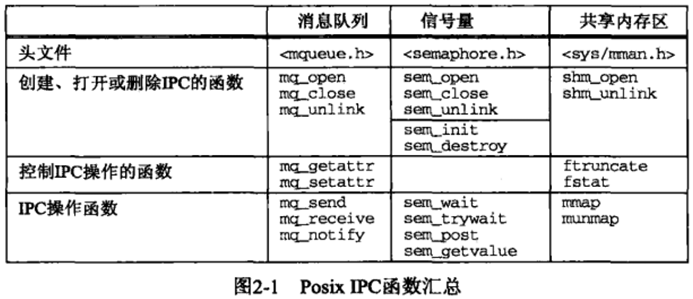
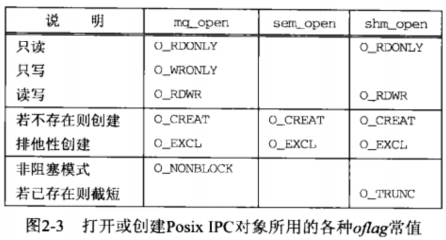
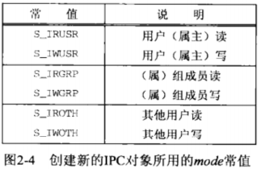
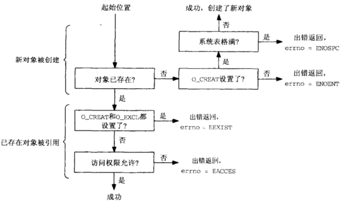
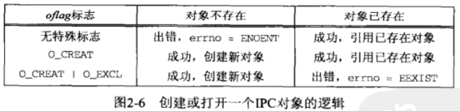

# 第2章 Posix IPC

## 2.1 概述

以下三种类型的IPC合称为 “Posix IPC”：
- Posix消息队列(第5章)
- Posix信号量(第10章)
- Posix共享内存区(第13章)

Posix IPC在访问它们的函数和描述它们的信息上有一些类似点。本章讲述所有这些共同属性：用于标识的路径名、打开或创建时指定的标志以及访问权限。



## 2.2 IPC 名字

三种类型的Posix IPC都使用“Posix IPC名字”进行标识，mq_open 、 sem_open和shm_open的第一个参数就是IPC名字。

IPC名字可能是文件系统中的一个真正的路径名，也可能不是。

Posix. 1是这么描述PosixIPC名字的：

- 它必须符合已有的路径名规则（最多由PATH_MAX个字符构成，包括结尾的空字符）。
- 如果它以斜杠符开头，那么对这些函数的不同调用将访问同一个队列(即：类似于绝对路径)。如果它不以斜杠符开头，那么效果取决于实现(即：类似于相对路径)。
- 名字中额外的斜杠符的解释由实现定义。

因此，为便于移植起见，Posix IPC名字必须以一个斜杠符打头，并且不能再含有任何其他斜杠符。遗憾的是这些规则还不够，不同系统的实现可能不同, 因而出现移植性问题。

例如：IPC名字为/test的消息队列，Solaris2.6会创建/tmp/MQ.test文件，BSD4.4会创建/test文件。[?]

当我们指定一个只有单个斜杠符打头的名字时（例如/test)，移植性问题就发生了：我们必须在根目录中具有写权限。因为有些实现会把名字视作文件名，会试图创建这个文件。这时除非拥有在根目录中的写权限，否则这样的尝试将失败。如果我们指定 /tmp/test 这样的名字，那么以该名字创建一个真正文件的系统都将成功（前提是/tmp目录存在，且在该目录中有写权限，这对于多数Unix系统来说是默认成立的），在Solaris下则失败。 

为避免这些移植性问题，我们把Posix IPC名字的#define行放在一个便于修改的头文件中，这样应用程序转移到另一个系统上时，只需修改这个头文件。

> 这是一个折衷的方法，以修改部分文件的代价，实现各系统上的通用。在 Posix中 ，称为 “造成不标准的标准方式 ”（a standard way of being nonstandard )

Posix. 1定义了三个宏：
- S_TYPEISMQ 
- S_TYPEISSEM
- S_TYPEISSHM
判断指定的IPC对象的类型信息。但不幸的是，这三个宏没有多大用处，它们仅在IPC对象使用某种独特的文件类型实现时有效 。例如在Solaris 2.6下这三个宏的计算结果总是0.

#### px_ipc_name 函数
解决上述移植性问题的另一•种办法是自己定义一个名为px_ipc_name 的函数，它为定位 Posix IPC名字而添加上正确的前缀目录。
```c
#include "unpipc.h" 
char *px_ipc_name (const char * name);
返回：若成功则为非空指针.若出错则为NULL
```

name参数中不能有任何斜杠符。
例如，调用
px_ipc_name(“/test")
在Solaris 2.6下返回一个指向字符串/test的指针，在Digital Unix 4.0B下 返 回一个指向字符串 /tmp/test的指针。存放结果字符串的内存空间是动态分配的，并可通过调用free释放。另外，
16 第 2 章 Posix IPC
环境变景PX_IPC_NAME能够覆盖默认目录。
图2-2给出了该函数的实现。

```c
char *px_ipc_name(const char *name){
	char	*dir, *dst, *slash;

	if ( (dst = malloc(PATH_MAX)) == NULL)
		return(NULL);

		/* can override default directory with environment variable */
	if ( (dir = getenv("PX_IPC_NAME")) == NULL) {
#ifdef	POSIX_IPC_PREFIX
		dir = POSIX_IPC_PREFIX;		/* from "config.h" */
#else
		dir = "/tmp/";				/* default */
#endif
	}
		/* dir must end in a slash */
	slash = (dir[strlen(dir) - 1] == '/') ? "" : "/";
	snprintf(dst, PATH_MAX, "%s%s%s", dir, slash, name);

	return(dst);			/* caller can free() this pointer */
}
// code 2-2
```

## 2.3 创建与打开IPC通道

mq_open、 sem_open和shm_open这三个函数创建或打开一个IPC对象， 它们的名为oflag的第二个参数指定怎样打开所请求的对象。 这与标准open函数的第二个参数类似。 图2-3给出了可组合构成该参数的各种常值。

前3行指定怎样打开对象： 只读、 只写或读写。 消息队列能以其中任何一种模式打开， 信号量的打开不需指定任何模式（信号量操作需要读写，因此默认需要读写访问权）， 共享内存区对象则不能以只写模式打开。



上表中最后四行是可选的。

#### O_CREAT
若目标对象不存在，则创建新对象。
在创建新对象时，需要另外一个mode参数指定权限，它是由以下常值按位或形成的。



这些常值定义在<sys/stat.h>中。

所指定的权限位受当前进程的“文件模式创建掩码”(file mode creation mask) 修正， 而该掩码可通过调用umask 函数或使用shell的umask命令来设置。

跟新创建的文件一样， 当创建一个新的消息队列/信号量/共享内存对象时， 其用户ID被置为当前进程的有效用户ID。信号量或共享内存区对象的组ID被置为当前进程的有效组ID或某个系统默认组ID。新消息队列对象的ID组和组 1D

> 这三种IPC在设置组ID上存在的差异多少有点奇怪。由open新创建的文件的组ID或者是当前进程的有效组ID， 或者是该文件所在目录的组ID. 但是 IPC函数不能假定系统为 IPC对象创建了一个在文件系统中的路径名。 


#### O_EXCL

该标志通常和O_CREAT搭配使用。简单来说，它限定了O_CREAT的作用仅为"创建新对象"。此时期望创建新对象，如果该对象己经存在则返回SEXIST错误。    

考虑到其他进程的存在， 检查指定IPC对象的存在与否和创建它（如果它不存在）这两步必须是原子的。

#### O_NONBLOCK

该标志使得消息队列在"队列为空时的读"与"队列填满时的写"不被阻塞。

#### O_TRUNC

如果以读写模式打开了一个已存在的共享内存区对象，那么该标志将使得该对象的长度被截成0。 





## 2.4 IPC权限

当xxx_open函数打开一个已存在的IPC对象时（或者未指定0_CREAT, 或者指定了0_CREAT但没有指定0_EXCL, 问时对象已经存在）， 将基于如下信息执 行权限测试： 

1. 创建时陚予该IPC对象的权限位； 

2. 所请求的访问类型（O_RDONLY、 O_WRONLY或O_RDWR );

3. 调用进程的有效用户ID、 有效组ID以及各个辅助组ID ( 若支持的话）。

大多数Unix内核按如下步骤执行权限测试。

1. 如果当前进程的有效用户ID为0 (超级用户）， 那就允许访问。

2. 在当前进程的有效用户ID等于该IPC对象的属主lD的前提下， 如果相应的用户访问权限位已设置， 那就允许访问， 否则拒绝访问。
> 这里相应的访问权限位的意思是： 如果当前进程为读访问而打幵该IPC对象， 那么用户读权限位必须设置； 如果进程为写访问而打开， 那么用户写权限位必须设置。

3. 在当前进程的有效组ID或它的某个辅助组ID等于该IPC对象的组ID的前提下， 如果相应的组访问权限位己设置， 那就允许访问， 否则拒绝访问。

4. 如果相应的其他用户访问权限位已设置， 那就允许访问， 否则拒绝访问。

这4个步骤是按所列的顺序尝试的。 例如， 如果当前进程拥有该IPC对象（ 第2步）， 那么访问权是否授予只依赖于用户访问权限，组访问权限绝不会考虑。

## 习题

2.1 使 用Posix IPC的程序， 其SU1D与SGID位（ APUE的4.4节） 是如何影响2.4节中所述的权限测试的？ 

2.2 当一个程序打幵一个Posix IPC对象时， 它怎样才能判定是创建了一个新对象还是在引用一个己有的 对象？    

