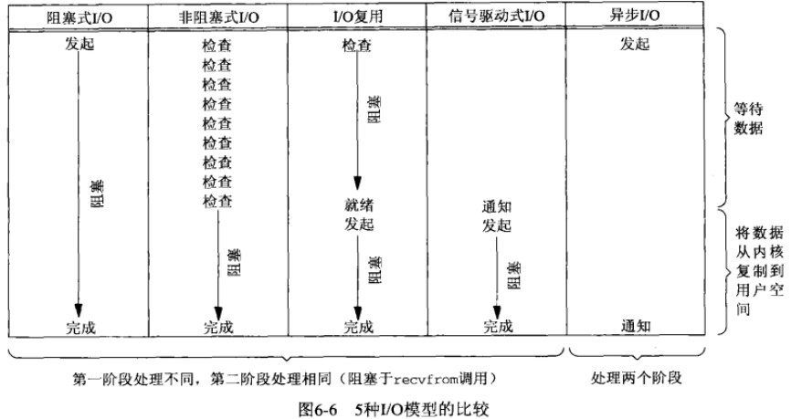
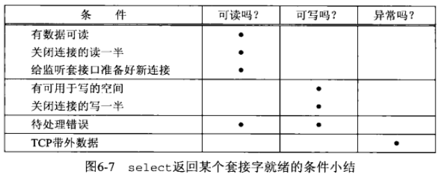

# IO复用

## IO模型

一个输入操作通常包括两个阶段

1. 等待数据准备好。例如等待标准输入就绪或网络数据到达
2. 从内核向进程复制数据。

等待阶段可能花费较长甚至无限的时间，拷贝阶段的耗时通常有限。

#### 阻塞式IO

最常见的IO模型。会一直等待数据就绪并复制完毕后才返回(或者出错返回)。常见的错误是被信号中断。

#### 非阻塞式IO

当请求的IO操作必须把进程投入睡眠才能完成时，则返回错误。

简单理解为，如果数据未就绪则立即返回错误，而不是等待数据就绪。

此时可以通过轮询的方式等待数据就绪，但是耗费计算资源。

#### IO复用

检查若干条件，等待其中任意条件就绪，再进行处理。

优势在于可以管理多个IO，防止阻塞于其中某个IO上时错过其他IO的信息。

#### 信号驱动式IO

当数据就绪时内核发送SIGIO信号，进程捕获信号并做相应处理。

优点在于等待数据就绪期间不会阻塞。

#### 异步IO

由POSIX规范定义。交付给内核执行等待数据和拷贝数据的任务，并在完成后通知进程。

该函数立即返回，并在整个任务期间进程不被阻塞。

#### 比较

前4种方式区别在于如何处理等待数据的阶段，而当数据就绪后，拷贝阶段依然需要阻塞处理。而异步IO整个过程都是不需要阻塞的。



前四种都是同步IO模型，第五种是异步IO模型。

## select函数

该函数允许进程指示内核等待多个事件中的任何一个发生。

事件指的是描述符可读/可写/有异常，或者是超时。

```c
#include<sys/select.h>
#include<sys/time.h>
int select(int maxfdp1,fd_set* readset,fd_set*writeset,fd_set* exceptset,const struct timeval* timeout);
返回：若有就绪描述符则为其数目，若超时则为0，出错-1
```

其中

```c
struct timeval{
  long tv_sec;
  long tv_usec;
};
```

1. 若select中timeval为空，则不限时。
2. 指定后，则倒计时为一个事件。
3. 若倒计时的值为0，则检查描述符后立即返回，轮询（polling）。

前两种会被信号中断返回EINTR错误。

尽管timeval结构允许指定微秒级别的分辨率，然而结合内核运算周期，通常为10ms的倍数。另外因为调度延时，倒计时结束后依然需要时间来调度进程运行

timeval是const，这意味着无法返回“还剩多少时间“的信息。

中间的读集//写集/意外集 指定我们让内核测试读写和异常条件的描述符。

异常条件目前包括

- 某个套接字的带外数据的到达。24章讲解
- 某个已置为分组模式的伪终端存在可从主端读取的控制状态信息。暂不讨论

集合：用描述符集，是一个整数数组，每一位对应一个描述符。

不必担心细节，可用fd_set数据类型和一些宏来操作

```c
void FD_ZERO(fd_set* fdset); //初始化，很必要！
void FD_SET(int fd,fd_set *fdset);
void FD_CLR(int fd,fd_set *fdset);
int FD_ISSET(int fd,fd_set *fdset);
```

读/写/异集，为空表示不关心

若三者都空，指定timeval则得到10ms级别的计时器。sleep以秒为单位

maxfdp1指定测试个数，它的值是待测试的最大描述符maxfd加1. (是个数，不是最大编号)。

从0到maxfd逐个测试，maxfdp1的意义在于控制搜索范围。

头文件select.h中定义FD_SETSIZE常值表示了描述符总数 1024，但是一般用不到这么大。

三个集合都是值-结果参数，select可以修改他们，并返回结果集合。用FD_ISSET来测试集合中的描述符以确定引起就绪条件的描述符。返回的结果集合，在就绪的描述符位置设为1，其他位置清零。

重新使用select函数时，需要重新设定集合。

两个容易错误：1.最大描述符加一 ；2.忘了集合是值-结果参数

### 描述符就绪条件

#### 一个套接字准备好读

1. 该套接字接收缓冲区中的数据字节数大于等于缓冲区低水位标记,此时读操作不会阻塞并返回一个正数。SO_RCVLOWAT来设置低水位，TCP和UDP默认1
2. 该连接的读半部关闭，即接收FIN。此时读操作立即返回0
3. 该套接字是一个监听套接字且已完成队列数不为0.对这样的套接字accept通常不会阻塞
4. 其上有一个套接字错误待处理，读操作会立即返回-1.这些待处理错误可以用SO_ERROR选项调用getsockopt获取并清除

#### 一个套接字准备好写

1. 发送缓冲区的可用字节数大于等于发送缓冲区的低水位标记，并且该套接字已连接或不需要连接（如UDP）。如果把套接字设为非阻塞，写操作将不阻塞并返回一个正值。可以SO_SNDLOWAT设置水位，TCP和UDP默认2048
2. 该连接写半部关闭。此时写操作会产生SIGPIPE
3. 使用非阻塞式connect的套接字已建立连接，或connect已经失败。
4. 其上有一个套接字错误待处理。写操作立即返回-1. SO_ERROR选项调用getsockopt获取并清除

#### 异常条件待处理

如果套接字存在带外数据或者处于带外标记。（24章）

#### 小结

任何UDP套接字只要其发送低水位标记小于等于发送缓冲区大小（默认应该总是这种关系）就总是可写的，因为不需要连接。（即，一般都是可写的）



### 最大描述符数

通常在内核中定义了FD_SETSIZE，指定了描述符数量上限，不易修改

不同厂家定义的值可能不同。

## 修订版str_cli函数

使用IO复用技术，使得子进程不会阻塞于fgets因而无法及时对服务器进行响应。

```c
#include"unp.h"
void str_cli(FILE* fp,int sockfd){
  int maxfdp1;
  fd_set rset;
  char sendline[MAXLINE],recvline[MAXLINE];
  
  FD_ZERO(&rset);
  maxfdp1=max(fileno(fp),sockfd)+1;
  Select(maxfdp1,&rset,NULL,NULL,NULL);
  
  if(FD_ISSET(sockfd,&rset)){
    if(Readline(sockfd,recfline,MAXLINE)==0)
      err_quit("str_cli: server terminated");
    Fputs(recvline,stdout);
  }
  if(FD_ISSET(fileno(fp),&rset)){
    if(Fgets(sendline,MAXLINE,fp)==NULL)
      return;
    Writen(sockfd,sendline,strlen(sendline));
  }
}
```

注意：对端发送 数据/FIN/RST 都会使得套接字可读

## 批量输入

上述程序的机制为：

当标准输入可读或TCP可读时，执行对应操作。

输入-发送-等待应答-输入-。。。这种问答模式是没问题的

如果把标准输入重定向到文件，由于文件总是可读的，所以会一直不断地读取文件的每一行并发送，直至EOF。其间可能夹杂着对端的回复。

【图】

双全功的通道可能占满

文件EOF之后，会return，此时应答数据可能还在路上没有收到。导致应答数据丢失。

所以，最好的方式是半关闭。表示不再发送，但是还在接收。

## shutdown

close局限

- 减计数机制。可以用shutdown直接终止
- close会终止两方向传送【？】shutdown可以只终止一方

原型

```c
#include<sys/socket.h>
int shutdown(int sockfd,int howto);返回：成功0 否则-1
```

howto参数

- SHUT_RD关闭读。不再读，且接收缓冲区清空。使用后，套接字接收到的对端数据会被确认然后丢弃。
- SHUT—WR关闭写。不再写，且发送缓冲区清空，后跟TCP的FIN挥手过程。
- SHUT_RDWR都关闭，等效于调用RD后再调用WR

> close 操作取决SO_LINGER？

## str——cli函数

```c
#include"unp.h"
void str_cli(FILE* fd,int sockfd){
  int maxfdp1,stdineof;
  fd_set rest;
  char buf[MAXLINE];
  int n;
  
  stdineof=0;
  FD_ZERO(&rset);
  for(;;){
    if(stdineof==0)
      FD_SET(fileno(fp),&rset);
    FD_SET(sockfd,&rset);
    maxfdp1=max(fileno(fd),sockfd)+1;
    Select(maxfdp1,&rset,NULL,NULL,NULL);
    if(FD_ISSET(sockfd,&rset)){
      if( (n=Read(sockfd,buf,MAXLINE))==0){
        if(stdineof==1)
          return;
        else
          err_quit("str_cli:server terminated");
      }
      Write(fileno(stdout),buf,n);
    }
    if(FD_ISSET(fileno(fp),&rset)){
      stdineof=1;
      Shutdown(sockfd,SHUT_WR);
      FD_CLR(fileno(fp),&rset);
      continue;
    }
    Writen(sockfd,buf,n);
  }
}
```

## 回射服务器

使用select来迭代处理

使用一个描述符集，是一个数组，初始化为-1.当接受某个连接时，对应描述符置为sockfd的值。后者是一个小正数。

```c
#include"unp.h"
int main(){
  int i,maxi,maxfd,listenfd,connfd,sockfd;
  int nready,client[FD_SETSIZE];
  ssize_t n;
  fd_sset rset,allset;
  char buf[MAXLINE];
  socklen_t clilen;
  struct socaddr_in cliaddr,servaddr;
  listenfd=Socket(AF_INET,SOCK_STREAM,0);
  bzero(&servaddr,sizeof(servaddr));
  servaddr.sin_family=AF_INET;
  servaddr.sin_addr.s_addr=htonl(INADDR_ANY);
  servaddr.sin_port-htons(SERV_PORT);
  
  Bind(listenfd,(SA*)&servaddr,sizeo(servaddr));
  
  Listen(listenfd,LISTENQ);
  
  maxfd=listenfd;
  maxi=-1;
  for(i=0;i<FD_SETSIZE;i++){
    client[i]=-1;
  }
  FD_ZERO(&allset);
  FD_SET(listefd,&allset);
  
  for(;;){
    rset=allset;
    nready=Select(maxfd+1,&rset,NULL,NULL,NULL);
    
    if(FD_ISSET(listefd,&rset)){
      clilen=sizeof(cliaddr);
      connfd=Accept(listenfd,(SA*)&cliaddr,&clilen);
      
      for(i=0;i<FD_SETSIZE;i++){
        if(client[i]<0){
          client[i]=connfd;
          break;
        }
        if(i==FD_SETSIZE)
          err_quit("too many clients");
        FD_SET(connfd,&allset);
        if(connfd>maxfd)
          maxfd=connfd;
        if(i>maxi)
          maxi=i;
        if(--nready<=0)
          continue;
      }
      for(i=0;i<=maxi;i++){
        if( (sockfd=client[i])<0)
          continue;
        if(FD_ISSET(sockfd,&rset)){
          if( (n==Read(sockfd,buf,MAXLINE))==0)
            Close(sockfd);
          	FD_CLR(sockfd,&allset);
          	client[i]=-1;
        }else
          Writen(sockfd,buf,n);
        if(--nready<=0)
          break;
      }
    }
  }
}
```

#### 拒绝服务攻击

单个客户恶意IO阻塞，占用大量时间，从而服务器拒绝为后续客户服务

- 使用非阻塞IO
- 并发
- IO超时

## pselect函数

它由POSIX发明。

```c
#include<sys/select.h>
#include<signal.h>
#include<time.h>
int pselect(int maxfdp1,fd_set *rset,fd_set* wset,fd_set* eset,const struct tiemspec* timeout,const sigset_t *sigmask);
返回：若有就绪描述符则返回其数目，超时0，出错-1
```

区别有两处

```c
struct timespec{
  time_t tv_sec;
  long tv_nsec;
};
```

指定纳秒。虽然不晓得是否实用

第六个参数，指向信号掩码的指针。允许禁止递交某些信号，再测试由对应信号处理函数设置的全局变量，然后调用pselect，告诉它重新设置信号掩码。

考虑下面的例子，这个程序的SIGINT信号处理函数仅仅设置全局变量intr——flag并返回。如果我们的进程阻塞于select调用，那么从信号处理函数的返回将导致select返回EINTR错误。然而，调用select时代码大体如下

```c
if(intr_flag) //测试
  handle_intr();
if( (nready=select(...))<0){
  if(errno==EINTR){
    if(intr_flag)
      handle_intr();
  }
  ...
}
```

如果在测试和调用select之间有信号发生，那么若select永远阻塞，该信号将丢失。有了pselect后，我们可以可靠地编写

```c
sigset_t newmask,oldmask,zeromask;
sigemptyset(&zeromask);
sigemptyset(&newmask);
sigaddset(&newmask,SIGINT);

sigprocmask(SIG_BLOCK,&newmask,&oldmask);
if(intr_flag)
  handle_intr();
if( nready=pselect(...,&zeromask)<0){
  if(errno==EINTR){
    if(intr_flag)
      handle_intr();
  }
  ...
}
```

在测试之前，令进程阻塞SIGINT。当pselect调用时，以zeromask替代进程的掩码，然后执行select类似操作。当返回时，恢复掩码。

关于信号阻塞：可能是进程有个信号槽，一种信号槽，只能容纳一个信号。信号到达信号槽，捕获并处理；此时信号槽依然被占据，后续同种信号达到后会被丢弃。直到处理函数完成，信号槽清空。

## poll函数

```c
#include<poll.h>
int poll(struct pollfd* fdarray,unsigned long nfds,int timeout);
返回，若有操作符就绪则返回数目，超时0，出错-1
```

第一个参数是指针，指向数组。数组长度由第二个制定。 数组元素是pollfd结构

```c
struct pollfd{
  int fd;
  short events;
  short revents;
};
```

events和revents相互对应，前者指定测试条件，后者返回测试结果，以避免值-结果参数。

【表】

分为三种优先级：普通 优先级带，高优先级。对TCP和UDP来说，以下

- 正规TCP和UDp数据是普通数据
- TCP带外数据是优先级带数据
- 当TCP的读半部被关闭（例如收FIN），普通数据，随后的读操作将返回0
- TCP链接存在错误即可以是普通数据，也可以是错误POLLERR。两者都，随后的读操作返回-1，并把errno设置合适的值。这可用于接收RST或超时等条件
- 在监听套接字有新的连接可用，即可认为普通数据，也可优先级数据。前者较为普遍
- 非阻塞connect的完成被认为是使相应套接字可写。

timeout毫秒数

- INFTIM 永远等待
- 0 立即返回
- 大于0；毫秒数

同样，取决于系统的时钟分辨率（通常10ms）

如果不关心某个描述符，可以把fd成员设置负值。poll将忽略它，返回时其revents的值为0.

相比于select，由于使用数组，因而没有上限问题。

## TCP回射服务器

```c
#include"unp.h"
#include<limits.h> //for OPEN_MAX
int main(){
  int i,maxi,listenfd,connfd,sockfd;
  int nready;
  ssize_t n;
  char buf[MAXLINE];
  socklen_t clilen;
  struct pollfd client[OPEN_MAX];
  struct sockaddr_in cliaddr,servaddr;
  
  listenfd=Socket(AF_INET,SOCK_STREAM,0);
  
  bzero...
  bind..listen...
  
  client[0].fd=listenfd;
  client[0].events=POLLRDNORM;
  for(i=1;i<OPEN_MAX;i++)
    client[i].fd=-1;
  maxi=0;
  
  for(;;){
    nready=Poll(client,maxi+1,INFTIM);
    if(client[0].revents&POLLRDNROM)
      clilen=sizeof(cliaddr);
      connfd=Accept(listenfd,(SA*)&cliaddr,&clilen);
    
      for(i=1;i<OPEN_MAX;i++)
        if(client[i].fd<0){
          client[i].fd=connfd;
          break;
        }
      if(i==OPEN_MAX)
        err_quit("too many clients");
    client[i].events=POLLRDNORM;
    if(i>maxi)
      maxi=i;
    if(--nready<=0)
      continue;
  }
  for(i=1;i<=maxi;i++){
    if( (sockfd=client[i].fd)<0)
      continue;
    if(client[i].revents&(POLLRDNROM | POLLERR)){
      if( (n=read(sockfd,buf,MAXLINE))<0){
        if(errno==ECONNRESET){
          Close(sockfd);
          client[i].fd=-1;
        }else
          err_sys("read error");
      }else if(n==0){
        Close(sockfd);
        client[i].fd=-1;
      }else
        Writen(sockfd,buf,n);
      if(--nready<=0)
        break;
    }
  }
  
  
  
  
  
  
}
```

OPEN_MAX由POSIX提供进程能接受的最多的描述符个数

