# 第一章 简介

## 1.1 概述

一般认为，服务器进程长期运行，主动请求由客户端发起。  

例外：异步回调(asynchronous callback)

#### 通信层次

网络数据从发出到接受的通信层次如下所示。



注:特别地，原始套接字(raw socket)可以绕过传输层，直接和网络层通信。

#### POSIX

Portable Operationg System Interface,可移植操作系统接口

## 1.2 一个简单的时间获取客户程序

使用TCP设计时间获取客户程序。

```c
#include "unp.h"
int main(int argc, char** argv){
    int sockfd;
    ssize_t n;
    char recvline[MAXLINE+1];
    struct sockaddr_in servaddr;

    if(argc!=2)
        error_quit("need <IPaddress>");

    if( (sockfd=socket(AF_INET,SOCK_STREAM,0))<0)
        error_quit("socket error");

    bzero(&servaddr,sizeof(servaddr));
    servaddr.sin_family=AF_INET;
    servaddr.sin_port=htons(13);
    if(inet_pton(AF_INET,argv[1],&servaddr.sin_addr)<=0)
        error_quit("inet_pton error for %s",argv[1]);

    if(connect(sockfd,(SA*)&servaddr,sizeof(servaddr))<0)
        error_quit("connect error");

    while( (n=read(sockfd,recvline,MAXLINE))>0){
        recvline[n]=0;
        if(fputs(recvline,stdout)==EOF)
            error_quit("fputs error");
    }
    if(n<0)
        error_quit("read error");
    exit(0);
}
```
注意：TCP无消息边界。IP层掌管发送细节，因而发送结果可能与预想不同。

可能出现：

- 多次较短的报文被合并（粘包）；
- 一次长的报文被拆分（拆包）。

## 1.3 协议无关性

上节中的代码是协议相关的。很多数据类型和常量在IPv4和IPv6中是不一样的。

## 1.4 包裹函数

用以自动检查错误并做默认处理，除非必须手动检测错误并做特别处理。

例如：在pthread_xxxx线程函数中，通常不设置errno值。所以我们可以在它们的包裹函数内设置errno值以便于检测错误。

#### errno

是一个用以记录错误的全局变量。通常Unix函数出错时会返回-1并设置errno为某个EXXX常值。

在多线程中，需要指定相关编译选项，使得errno被编译成函数指针，以调用各线程的变量副本。

## 1.5 一个简单的时间获取服务器程序

```c
#include "unp.h"
int main(int argc,char** argv){
    int listenfd,connfd;
    struct sockaddr_in servaddr;
    char buff[MAXLINE];
    time_t ticks;

    listenfd=Socket(AF_INET,SOCK_STREAM,0);

    bzero(&servaddr,sizeof(servaddr));
    servaddr.sin_family=AF_INET;
    servaddr.sin_addr.s_addr=htonl(INADDR_ANY);
    servaddr.sin_port=htons(13);

    Bind(listenfd,(SA*)&servaddr,sizeof(servaddr));

    Listen(listenfd,LISTENQ); //LISTENQ常值，预先在"unp.h"定义

    for(;;){
        connfd=Accept(listenfd,NULL,NULL); //投入睡眠直到被可用的客户接入唤醒

        ticks=time(NULL);
        snprintf(buff,sizeof(buff),"%.24s\r\n",ctime(&ticks));
        Write(connfd,buff,strlen(buff));

        Close(connfd);
    }
}
```
要点
- listen函数把套接字转换为监听套接字，才能完成后续步骤。
- time函数返回自1970年的秒数；ctime把秒数转为日期字符串。

TIP

- 查看网络状态：netstat和ifconfig指令，提供接口状态和信息
- 服务器程序类型:迭代和并发。前者逐个处理客户请求，后者并行处理请求。

注意

客户端申请的字符数组长度是MAXLINE+1,因为需要存储字符串用于fputs屏幕显示;服务器不需要字符串,它只需要存储字节流,所以不需加一.

#### [此处某些章节略过]

## 1.11 系统体系与接口类型  

#### 系统类型  

- 32位：称为ILP32模型。表示整数(I)长整数(L)和指针(P)占32位。
- 64位：称为LP64模型。此时不能假设指针可以存放在一个整数中  

#### 接口类型

size_t类型：用于提供统一的接口，便于移植。它在32位中是32位的，在64位中是64位的。这意味着64位系统中可能隐含`typedef size_t unsigned long`定义 。

套接字中设计了socklen_t等类型，用于提供统一接口


