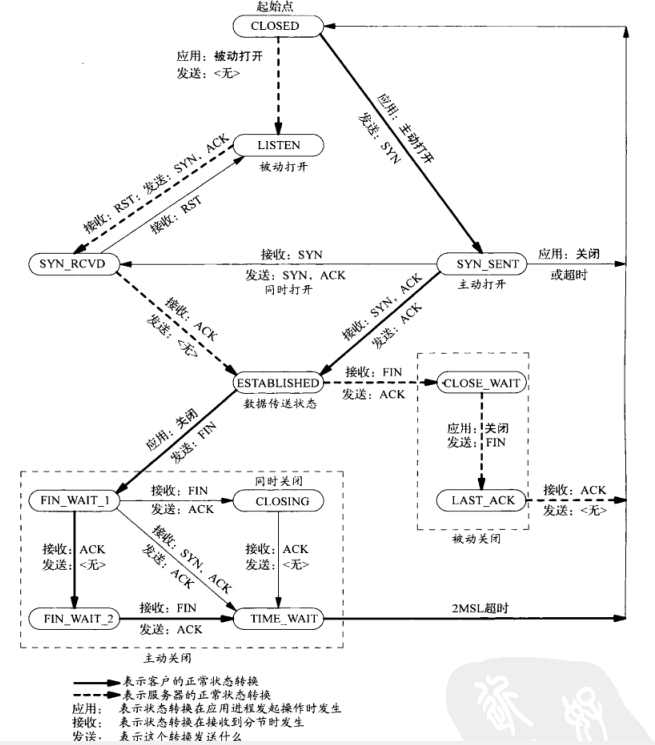
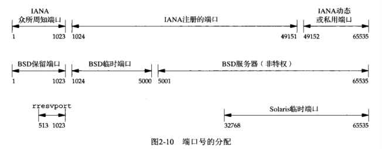
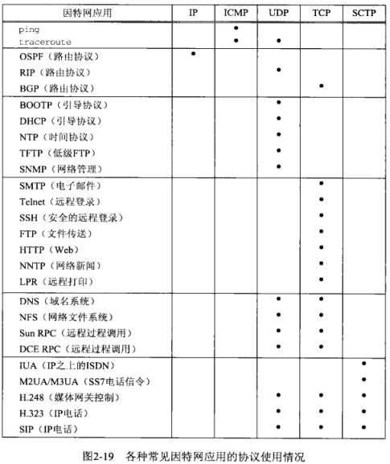

## 第二章 传输层：TCP、UDP、STCP

## 1.1 概述

本章介绍传输层，包括TCP、UDP和STCP。这些协议都转而使用网络层协议IPv4或IPv6。尽管可以绕过传输层而直接使用网络层，但这种技术(往往称为原始套接字)很少使用。

## 2.2 总图

各个应用使用的协议以及层次关系

要点  
- ICMP网际控制消息协议：处理路由和主机间的错误和控制消息

- IGMP网际组管理协议：用于多播

- ARP地址解析协议：把IP地址解析为硬件地址，RARP则反向解析

- IGMPv6：包含了ICMP、IGMP、ARP、RARP的功能

- BPF(BSD分组过滤器)和DLPI(数据链路提供者接口)提供对数据链路的直接访问

注：以上未表示SOCK_PACKET绕过传输层的情况

## 2.3 用户数据报协议(UDP)

#### UDP特点
- 无连接：传输双方不存在长期的连接关系
- 不可靠：不保证到达，不保证保持顺序，不保证只接收一次
- 消息有界：数据长度值随报文发送

## 2.4 传输控制协议(TCP)

#### TCP特点

1. 传输连接：TCP要求传输双方的连接。

2. 可靠性  
    - 发送后要求对方确认。如超时未收到，则自动重传数次。

      通过动态估计往返时间(round-trip time, RTT)以确定时限。

      再次重传时，时限会有所延长，整个过程可能花费数分钟。

    - 关联序号进行排序。对发出的每个分节关联一个序号，对方接收后按序重排。以此保证数据顺序不变，且无重复。

      > 注意：TCP的可靠性并不保证数据一定到达，这是不可能的。TCP只是保证用完备的验证手段提供数据的可靠递送或故障的可靠通知。

3. 流量控制  
     告知对方，本端当前的接收容量(通告窗口)的大小，对方会以此进行调整。

     通告窗口大小会实时变动。当通告窗口为零时，代表本端不能接收新数据，需要等待应用从缓冲区读取数据后，才能继续接收新数据。

4. 全双工  

     发送和接收两个方向保持独立,因此两个方向的状态和配置可能不同。可以转换为半双工。  

     > UDP可以是全双工的。  

TIP：分节是TCP传递给IP的数据单元.

## 2.5 流控制传输协议(SCTP)

#### SCTP特点

- 关联：多个连接。
- 提供类似TCP的可靠性、关联序号、流量控制和全双工等特性。
- 面向消息，有界。数据长度随报文发送。
- 拥有多个流，各自独立
- 提供多宿特性，支持多个IP地址

## 2.6 TCP连接的建立和终止

### 三路握手

建立一个TCP连接时的三次握手示意图如下

过程
1. 服务器调用socket bind listen被动打开,以准备接受连接
2. 客户调用connect主动打开,发送SYN分节
3. 服务器确认(ACK)客户的SYN分节,以及自己的SYN.这两者在同一个分节中发出
4. 客户确认(ACK)服务器的SYN分节

要点
- SYN分节告诉对方，本端在将建立的连接中发送的分节的初始序号。SYN分节通常不携带数据，只携带IP和TCP首部以及可能的TCP选项。
- ACK是确认分节，通常是某个序号加一。

##### TCP选项

每个SYN可以含有多个TCP选项.常见的有

- MSS选项，最大分节大小(maximum segment size)。表示本端在TCP分节中愿意接受的最大数据量，对端会依据这个值做发送调整。可用TCP_MAXSEG选项设置和提取。

- 窗口规模选项。默认为65535，因为TCP首部中相应字段占16位。但是某些技术允许更高的窗口量，该选项指定65535左移的位数(即65535<<N,其中N在[0,14]之间)。可用SO_RCVBUF选项设置和读取。

    > 必须双方都确认对方支持该选项后，才能生效。客户发出该选项的请求，只有在对方的回馈中也包含该选项时才能生效。类似的，服务器在受到对方包含该选项的请求时，才能发送该选项。

- 时间戳。开发者暂可不考虑。

### 连接终止

四次挥手如下图所示。

过程

1. 主动端调用close进行主动关闭,发送FIN分节
2. 被动端进行确认
3. 被动端主动调用close,发出FIN
4. 主动端进行确认

要点

- 圈2处接收FIN分节，传递EOF(放在排队数据尾)给进程，read函数读至EOF会返回0.

- 圈4处的close是进程主动调用的，而非自动调用的。

- 挥手过程通常需要4个分节。"通常"是因为,可能步骤1的FIN分节随数据合并发送，可能步骤2的ACK和步骤3的FIN合并发送。

- 步骤2和3之间，从被动关闭方到主动关闭方的数据流动是可能的。这称为半关闭(half-close)。

    > FIN的发送仅仅代表本端不再发送数据而已,不代表不可以接收数据.对于close的关闭会在后续章节讨论.

- FIN分节由close操作触发，但进程主动(exit或从main返回)或被动终止(收到终止进程的信号)时都会关闭打开的描述符，也会发出FIN。

- 通常主动关闭方是客户端。

TCP状态转换图

表示系统状态受接收分节或者进程主动操作而发生转换的情况。

要点

- 上图中默认主动关闭方是客户端,但并不限于客户端。
- 同时打开和同时关闭(simultaneous open/close)的情况很罕见，暂不讨论

#### 关于请求和确认

TCP在发送数据(请求)后，要求对方回复一个确认。如果此时对方需要发送数据作为应答，则确认随应答一起发出，称为捎带(piggybacking), 通常在应答和确认产生间隔200ms内发生。否则会先确认后应答.

## 2.7 TIME_WAIT状态

主动发送方在TIME_WAIT状态滞留2MSL时间后转为关闭状态。MSL(maximum segment lifetime)是最长分节生命期，即分节在网络中存活的最长时间，是利用分节中跳限(hop limit)字段实现的。MSL通常默认为30秒或2分钟。

主动关闭方在TIME_WAIT状态期间通常不会发起和接受新的连接。

#### 迷途

迷途是路由异常的结果。在网络拥堵或断开重建的过程中，分组可能在某些路由之间来回跳转。而在迷途期间，发送方超时重传，并且重传的分节到达目的地。而迷途的分组在不久后到达目的地，因此迷途的分组是意外而多余的。迷途的分组称lost dupllicate或漫游的重复分组(wandering duplicate)。

#### TIME_WAIT存在的意义

- 可靠地实现全双工连接的终止。若最终的ACK丢失，被动关闭方会重传FIN，此时主动方需要维持一个状态来处理这种情况。若否,主动方在CLOSE状态受到一个FIN会回应RST以表示一个错误。

- 若一个连接终止，而后双方在相同的网络地址上建立新连接，则新连接被称为旧连接的化身(incarnation)。为了防止旧连接中的报文迷途并延时到达，所以延时2MSL保证旧连接的报文正常消逝。两倍的MSL是主动关闭方的分节,经过发送和回馈两段时间的总和。

   > 例外：如果接收的SYN序号大于旧连接的结束序列号，源自Berkeley的实现会立即建立新连接。

## 2.8 SCTP的建立和终止

### 四路握手

过程

1. 服务器被动打开,以准备接受请求
2. 客户端调用connect主动打开，发送INIT分节
3. 服务器回馈INIT ACK分节
4. 客户端回复COOKIE ECHO来确认cookie
5. 服务器进行确认

要点

- INIT分节包含本端IP地址清单、初始序号、验证标记、请求的外出流数目和支持的外来流数目
- INIT ACK分节包含本端IP地址清单、初始序号、验证标记、请求的外出流数目和支持的外来流数目，以及状态cookie。状态cookie经过数字签名，包含本端用于确认本关联所需的所有的信息集合。
- COOKIE ECHO分节以及COOKIE ACK分节中可能还捎带了用户数据块。
- 验证标记：在本次关联中，需要对方发送的每个分节包含该验证标记。
- 握手结束后，两端各自选择一个主目的地址(primary destination address)作为默认目的地址。

### 关联终止

时序图如下所示。

要点

- SCTP没有半关联状态。一方关闭后，另一方必须立即自行关闭(发送完排队数据后)。因而圈2处的close是自动调用的。
- 被动方收到主动关闭请求，会发送EOF给进程，read返回0.
- SCTP没有TIME_WAIT状态，验证标记可以有效地防止旧关联中的迷途分节被新关联误认。
- 圈1处，close调用后，进入SHUTDOWN-PENDING状态，发送完排队数据后才进入SHUTDOWN-SENT状态。
- 圈2处，接收到对方SHUTDOWN后，进入SHUTDOWN-RECEIVED状态，发送完排队数据后才进入SHUTDOWN-ACK-SENT状态。

#### 状态转移图

要点

- 上图默认是客户端主动关闭。然而主动关闭不限于客户端。

#### TIP

STCP分组中的信息以块(chunk)为基本单位。块是自描述的，包含块类型、块标记和长度信息。

### STCP选项

STCP选项仍在扩展中，包括动态地址以及不完全可靠性扩展，前者可以从关联中动态增删地址，后者可以限制陈旧数据的重传。

## 2.9 端口号

端口号是16位整数。端口号是用来区分进程的，所以端口号并不是物理的描述。这意味着TCP、UDP和SCTP可以使用同一个端口号。

IANA维护着端口号分配清单。端口号可以分为

- 众所周知的端口号(well-known)
- 已登记的端口号,可能分配给某些组织
- 临时(动态、私有)端口号

要点

- unix把1-1023端口视作保留端口，分配该端口需要超级用户特权。所有IANA众所周知的端口都是保留端口。
- 不同的系统实现中，分配情况可能不同
- 某些客户(而不是服务器)需要保留端口用于验证,如上图的rresvport库函数会在513-1023区间绑定端口号.

#### 套接字对

TCP套接字对是一个定义TCP连接的两个端点的四元组：本地IP和端口+目标IP和端口。套接字对唯一标识一个TCP连接。分组在接收过程中必须对四个元素都进行验证。

IP地址和端口的组合,本文中称为网络地址,它们定义了一个套接字的地址.

> 从这种角度来说，socket翻译成“套接口”可能更合适，更何况本身就是“插口”的意思。

SCTP套接字在多宿情况下，可能需要多个四元组。如果是单一连接，则与TCP的四元组无异.

## 2.10 TCP端口号和并发服务器

一个并发服务器的连接过程如下所示。简便起见，认为服务器IP地址为192，客户端IP地址为206.

过程
1. 服务器建立监听套接字`(*:88,*:*)`,表示接受的连接限制为：不限源IP地址/端口，不限目标IP地址/端口号为88.
2. 客户端发起一个连接请求：`(206:15,192:88)`。服务器验证通过该连接请求，生成已连接套接字用于通信，并托付至子进程。此时连接在客户端和服务器子进程之间建立。

问题：服务器父进程和子进程拥有同一个网络地址。如果另一个客户端发出`(123:20,192:88)`时会发生什么？从目标地址来看，服务器父进程和子进程都拥有(192:88)地址，此时如何判定？  

此时传输层协议会验证发送者地址，发现(123:20)不属于子进程中任意已建立的连接，会递送至父进程。

同理，如果多个客户端分别与多个子进程实现通信，那么根据报文中的四元组，传输层协议会查看源地址来确定投递目标。这是由相关协议自动完成的。

> 可以简单认为，网络传输过程是由内核直接控制的，进程只是使用内核提供的资源和接口而已。进程可以控制和利用套接字，但进程并不直接拥有和管理套接字。
> 进程可以认为是住户，内核是大楼管理者，套接字是住户邮箱。内核接收邮件并分发给各个住户。一个家族可以有多个住户(子进程)，这些住户共用一个名字。内核根据邮件发件人，正确分配邮件至各个进程。

## 2.11 缓冲区大小及限制

这里的缓冲区大小，实际表示的是报文长度。

- IPv4数据报最大65535字节，包括IPv4首部。这是因为报文中记录总长度的字段占16位。

- IPv6数据报最大65575字节，包括40字节的IPv6首部。这是因为报文中净荷长度字段占16位。净荷长度不含IPv6首部。

   IPv6有一个特大净荷(jumbo payload)选项，它把净荷长度字段扩展到32位，不过需要MTU超过65535的数据链路提供支持(通常为主机到主机的内部连接设计)。

- MTU(maximum transmission unit,最大传输单元)表示由硬件支持的报文的最大字节数。例如以太网的MTU是1500. IPv4要求MTU最低为68字节，包括20字节固定长度和最多40字节的选项部分，以及最小的片段8字节(首部中片段偏移量字段以8为单位)。IPv6要求MTU最小为1280字节(或者依赖特定功能使得链路看起来至少为1280字节)。

- 在两个主机之间的路径中最小的MTU称为路径MTU，两个方向上的MTU可以是不对称的,这是由于两方向的传输路径可能不一致。

- IP数据报送出时，若超过输出链路的MTU，IPv4和IPv6会分片(fragmentation)。这些片段在到达最终目标前通常不会重组(reassembling)。IPv4主机对其产生的数据报分片，IPv4路由器则对转发的数据报进行分片。IPv6只有主机对其产生的数据报进行分片，IPv6不会对路由器转发的数据报进行分片。不过路由器可能(作为主机)产生数据报并进行分片。

- IPv4首部中“不分片(don't fragment, DF)”位若被设置，则主机和路由器都不会分片。如果路由器收到DF的数据报但是其超出了路由外出链路，则产生一个ICMPv4错误："目的不可达但设置DF位"。IPv6路由器不分片，所以IPv6数据报隐含DF位，此时若数据报过大会产生一个ICMPv6错误：”分组太大“。

  IPv4的DF位和IPv6的隐含DF位可用于路径MTU发现。可以设置DF位，然后尝试发送不同大小的分组。若接收到错误，则减少数据量并重传，以此可推测路径MTU的值。路径发现对于IPv4是可选的，但IPv6的所有实现要么支持它，要么必须总是使用最小的MTU发送。

   > 现今某些防火墙会丢弃ICMP消息，所以路径发现并不可靠。另外有些作为路由器的防火墙有可能重组分片的报文，以验证内容。

- IPv4和IPv6都定义了最小重组缓冲区大小(minimum reassembly buff size)。对于IPv4为576字节，对于IPv6是1500字节。任何IPv4和IPv6的实现必须支持该大小。

- TCP有一个MSS(maximum segment size,最大分节大小)。用于向对端通告自己能接受的TCP分节**数据量**大小，用以顺利通过所有链路并避免分片。MSS经常设置为MTU减去IP和TCP首部的固定长度，如以太网中MTU为1500，IPv4中MSS=1500-20-20=1460，IPv6中MSS=1500-20-40=1440.

   在TCP选项中MSS值是16位的字段，上限为65535，而IPv4数据报中最大数据量为65535-20-20=65495. MSS为65535只对具有特大净荷选项的IPv6有意义，表示不限制MSS值，此时主机和路由器根据具体情况中接口MTU进行分片。如果路径MTU较小，则路径MTU发现功能将确定这个较小值。

- SCTP基于到对端所有地址发现的最小MTU保持一个分片点。SCTP_MAXSEG选项可以设定更小的分片点。

#### TCP输出

- 每个TCP套接字都有一个发送缓存区(可用SO_SNDBUF选项调整)。调用write时，内核从进程的缓冲区复制数据到套接字发送缓冲区。如果套接字发送缓冲区的可用空间不足，则该进程投入睡眠(如果套接字是阻塞的)。直到复制完毕后write函数返回。因此，write函数成功返回仅仅表示复制过程完成(相关选项SO_LINGER)。

- 发送缓冲区的数据直到收到对方的确认后，才会被丢弃，否则会一直保留用于重传。

- 本端TCP以对端MSS或更小的块(默认536)把数据传递给IP，同时给每个数据库安装TCP首部以构成TCP分节。536=576(最小重组缓冲区字节数)-20(TCP首部)-20(IPv4首部)。

- IP给每个TCP分节安装IP首部构成IP数据报，并按照目的IP查找路由表项以确定外出接口，并投递给相应数据链路。投递前可能分片。

- 每个数据链路都有一个输出队列，如果已满，则新分组会被丢弃并产生错误。错误层层上传至TCP层，TCP将重传。进程并不了解这些细节。

TCP层通常会按对端MSS大小的块传递数据给IP层(并安装TCP首部)，IP层安装IP首部后传递数据给数据链路层。MSS通常是MTU减去TCP和IP首部固定长度的值，因此数据传出时通常按MTU大小，以避免分片。

#### UDP输出

- UDP的发送缓冲区并不存在，它虽然有发送缓冲区大小的值(相关选项SO_SNDBUF)，但是仅仅表示写到该套接字的UDP数据报的大小上限。如果进程发送时超过该上限，内核将返回进程EMSGSIZE错误。

- UDP不会保留数据副本。数据拷贝到内核并在某一级被转发后，直接丢弃。
- UDP给数据报安装8字节的首部构成UDP数据报，然后传递给IP层。
- IP层安装首部，执行路由操作确认外出接口并传递给数据链路。其间可能分片(如果超出MTU)。由于UDP缺少MSS选项，因而大数据报更可能被分片。
- write返回成功表示数据加入到数据链路的输出队列。若后者已满则返回ENOBUFS给进程(但某些UDP不返回这种错误)。

#### SCTP输出

类似于TCP，SCTP有发送缓冲区，可以用SO_SNDBUF选项设置。

除了没有MSS选项之外，其他过程基本类似。

## 2.12 标准因特网服务(略)

## 2.13 常见因特网应用的协议使用

以下总结了常见的因特网应用对协议的使用情况。

## 习题

TIP: SCTP中，确认可分为累积性确认和选择性确认，后者仅确认特定序号对应的数据，前者确认特定序号前的所有数据。