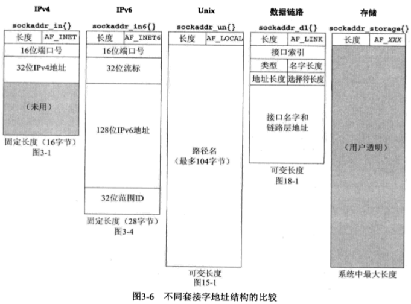

# 第3章: 套接字编程简介

## 3.1 概述

本章介绍套接字的地址结构和常见操作。

## 3.2 套接字地址结构

每个协议族都定义自己的套接字地址结构，以sockaddr_开头。

### 3.2.1 IPv4 套接字地址结构

```c
// Defined In: <netinet/in.h>
struct in_addr{
  in_addr_t			s_addr;			//32-bit IPv4 address
};
struct sockaddr_in{
  uint8_t			sin_len; 		//length of struct(16)
  sa_family_t		sin_family;     //(AF_INET)
  in_port_t			sin_port;		//16-bit port number
  struct in_addr	sin_addr;
  char				sin_zero[8];	//unused
};
```

- sin_len是4.3BSD中添加的,通常无需手动设置以及检查(例外是路由套接字)。

  > 从进程到内核传递地址结构的四个函数(bind,connect,sendto,sendmsg)调用时需传入地址结构体长度参数len,内部会调用sockargs函数来复制套接字地址结构体并将其sin_len字段设置成len.
  > 从内核到进程传递地址结构的五个函数(accept,recvfrom,recvmsg,getpeername,getsockname)调用时会设置传出结构体的sin_len字段.

- POSIX规范只需family,port和addr三个字段,没有要求sin_len字段.使用该地址结构的函数通常需要指定长度参数，从而避免使用长度字段，因而可以在不支持长度字段的系统中使用.有些旧系统没有该字段，遗憾的是，难以通过简单的测试确定这一点。

- 定义额外的字段是可以接受的，几乎所有的实现都定义了zero字段。

- in_addr_t必须是一个至少32位的无符号整型; in_port_t 必须是一个至少16位的无符号整型。sa_family_t在支持sin_len的系统中通常是8位无符号整数，在不支持sin_len的系统中是16位的无符号整数。

  | type             | info                 | include        |
  | ---------------- | -------------------- | -------------- |
  | int8_t/uint8_t   | 带/无符号8位整型            | <sys/types.h>  |
  | int16_t/uint16_t | 带/无符号16位整型           | <sys/types.h>  |
  | int32_t/uint32_t | 带/无符号32位整型           | <sys/types.h>  |
  | sa_family_t      | 套接字地址结构的地址族          | <sys/socket.h> |
  | socklen_t        | 套接字地址的长度,一般为uint32_t | <sys/socket.h> |
  | in_addr_t        | IPv4地址,一般为uint32_t   | <netinet/in.h> |
  | in_port_t        | 端口号,一般为uint16_t      | <netinet/in.h> |

- IP地址和端口号是按网络字节序来存储的。

- 32位IPv4地址存在两种不同的访问方法:

  1. address.sin_addr: 按in_addr结构体类型来引用
  2. address.sin_addr.s_addr: 按in_addr_t类型(通常是一个32位整数)来引用

  混淆这两种方法通常会导致错误。

- sin_zero字段按惯例必须置零。

- 套接字地址结构仅在本机上使用,本身不在网络间传递。

### 3.2.2 通用套接字地址结构

该地址结构可以指代任意类型的套接字地址结构.

```cpp
//Define In: <sys/socket.h>
struct sockaddr{
  uint8_t 		sa_len;
  sa_family_t	sa_family;
  char			sa_data[14];
};
```

思考：可以看出,为了支持不同长度的IP地址/端口号, 该函数并没有给定IP地址/端口号字段的固定长度，而是把这些内容放入到一个数组中。 函数运行时可以根据地址族的种类，划定数组中哪部分构成IP地址，哪部分构成端口号，以及各自占用的长度; 该地址传递时采用指针+长度的方式，很接近数组.

例如:

```int bind(int, struct sockaddr*, socklen_t);```

历史上, 此类函数定义时还未有```void*```类型，所以函数仅接受```sockaddr*```类型的指针，所以当使用IPv4地址结构时需要做强制转换:

```c
struct sockaddr_in address;
bind(sockfd, (struct sockaddr*)&address, sizeof(address));
```

原书中为了方便书写，定义`define SA struct sockaddr`用于使用。

思考: 

- 该结构体的唯一作用就是对不同种类套接字地址做强制转换，使得参数传入的接口变得统一。函数内部依然需要针对不同种类的地址(根据地址族字段)做不同的处理，这样只是统一函数接口。
- 该类型更多的是作为"指针"来使用的，多数情况并不用于"容纳"地址.实际上,它的长度不足以容纳IPv6和Unix域等地址。强制转换的结果，就是把原协议族数据分配至自己的family成员，原地址数据分配给自己的data指针。
- 上文说过,sa_family_t在支持sin_len的系统中通常是8位无符号整数; 在不支持sin_len的系统中是16位的无符号整数，又因为网络序为大端模式，所以此时sa_family字段的高8位(全是0)在前。 这样的话，无论有没有sin_len字段，sa_family的有效字节都在整个结构体第二个字节的位置。

### 3.2.3 IPv6套接字地址结构

```c
// Defined In: <netinet/in.h>
struct in6_addr{
  uint8_t s6_addr[16];				//128-bit address
};

#define SIN6_LEN

struct sockaddr_in6{
  uint8_t			sin6_len;		//length of struct(28)
  sa_family_t		sin6_family;    //AF_INET6
  in_port_t			sin6_port;
  
  uint32_t			sin6_flowinfo;
  struct in6_addr	sin6_addr;
  uint32_t			sin6_scope_id;
};
```
要点
- 如果系统支持套接字地址结构中的长度字段，那么SIN6_LEN必须定义
- IPv6的地址族是AF_INET6; IPv4的地址族为AF_INET
- 字段做过编排，使得如果地址结构按64位对齐,则sin_addr字段也是64位对齐的，以提高某些系统的访问效率

其他字段暂不做讨论。


### 3.2.4 新的通用套接字地址结构

该地址结构可以容纳任意类型的套接字地址结构。

```c
// Define In: <netinet/in.h>
struct sockaddr_storage{
  uint8_t		ss_len;
  sa_family_t	ss_family;
  /*其他部分取决于实现*/
};
```

类似于旧的通用地址结构sockaddr，结构体后部可以放入数组(取决于实现)。测试发现结构大小为128，测试环境Ubuntu16.04。

相比于旧的通用地址结构sockaddr:

1. 可以满足最苛刻的对齐要求
2. 容量足够大。旧通用地址不足以容纳较大的地址类型

该类型意义在于容纳所有类型的地址，同时亦可做统一接口使用(类似于sockaddr)。

例如,在不明具体地址类型的情况下，无法贸然使用特定类型的结构体以容纳目标地址,只能使用通用地址类型。

另,通用地址中数组部分是用户透明的。

和旧的通用地址一样，使用时通常需要强制类型转换。

### 3.2.5 套接字地址结构的比较



特别注意的是，多数地址长度是可变的，因而操作时一般需要一个地址长度参数。

## 3.3 值-结果参数

调用地址结构的函数中，通常需要结构体指针参数以及长度参数.

- 从进程到内核(传入): bind, connect, sendto  

  使用长度参数，让内核知道该从进程复制多少数据进来  

  ```int bind(int, struct sockaddr*, socklen_t);```


- 从内核到系统(传出): accept, recvfrom, getsockname, getpeername  

  使用长度指针参数，可以双向传输结构体的长度信息。

  ```int accept(int, struct sockaddr*, socklen_t*);```

  双向传输长度信息是指: 
  - 当函数调用时,传入长度信息，告诉内核该结构体的容量，以免内核在写入数据到结构体时越界; 此时该参数作用是传入"值"
  - 当函数返回时，传出内核实际写了多少数据到结构体。此时该函数作用是传出"结果"

  此时，称该类型的参数为"值-结果"参数。简单来说，就是使用指针的方式，可以完成双向传递的参数。

  对于固定长度的地址结构，传入传出的数据可能一致; 反之，传出的数据可能不一致(传出者可能较小)。

## 3.4 字节排序函数

内存的两种字节序(这里的"前"指的是内存较低处):

1. 大端模式: 高字节在前
2. 小端模式: 低字节在前

数据的最高位和最低位:

1. MSB(most significant bit): 数据的最高位
2. LSB(least significant bit): 数据的最低位

一般从书写的角度看，数据最高位写在最左边，也作0号位。(为避免混淆称第一位为0号位)

网络位序中，最左边定为最高位(0号位)很常见。

注意: 内存的最小单元是字节。对于uint16的数据0x1234, 高字节是0x12，低字节是0x34。在大端模式下0x1234(和书写顺序一致)，小端模式下是0x3412。

套接字地址结构中某些字段按网络字节序维护，网络字节序是大端模式。

用于字节顺序转换的函数:

```c
#include<netinet/in.h>
uint16_t htons(uint16_t host16bitvalue);
uint32_t htonl(uint32_t host32bitvalue);
均返回:网络字节序的值
uint16_t ntohs(uint16_t net16bitvalue);
uint32_t ntohl(uint32_t net32bitvalue);
均返回:主机字节序的值
```

- h代表host，n代表network
- s代表short(视作16位)，l代表long(视作32位)。这种表示出于惯例, 并不管本地short和long的真实长度

思考: 网络传输数据的基本单位是字节。假设一段报文包含一个4个字节IP地址，系统必须知道这4个字节是按照哪种方式排列，才能解析成正确的32位整数。字节排序函数的作用，就是把整数按大端模式重新排列各个字节，然后填充给地址结构体(以及相反的过程)。也就是说，操作的对象是内存的"字节"，而非这些字节表示的"值"。

## 3.5 字节操纵函数

用以 清空/拷贝/比较 内存.

1. 以b开头的函数: 起源4.2BSD

   ```c
   #include<strings.h>
   void bzero(void* dest, size_t nbytes);
   void bcopy(const void* src, void* dest, size_t nbytes);
   int bcmp(const void* ptr1, const void* ptr2, size_t nbytes);
   	//返回: 相等则0,否则为非0
   ```

2. 以mem开头的函数: 起源ANSI C

   ```c
   #include<string.h>
   void* memset(void* dest, int c, size_t len);
   void* memcpy(void* dest,const void* src, size_t nbytes);
   int memcmp(const void* ptr1, const void* ptr2, size_t nbytes);
   	//返回: 相等则为0,否则为非0
   ```


比较:

   - memcpy可以指定第二个参数来初始化为任意值, bzero只能初始化为零

   - memcpy类似于bcopy, 但参数顺序是相反的

     > ANSI C中很多函数都是dest在前src在后, 如同赋值语句dest=src;
     > 所有的ANSI C的mem函数都需要长度参数，而且总是最后一个参数

   - 两者都对源数据进行const保护。bcopy可以对内存重叠正确处理，但memcpy结果不可知(此时应改用memmove)

   - 比较字节串时，若不同，则返回第一个不同元素的比较关系，类似于字符串的比较

     比较方式为逐字节比较，比较的对象是内存中的字节。

     ```c
     signed char a[2]={-1,-1};
     unsigned char b[2]={255,255};
     printf("%d",memcmp(a,b,2)); // 输出: 0
     ```

## 3.6 inet_aton、inet_addr和inet_ntoa函数

用于在ASCII点分字符串和网络字节序的二进制值传递IPv4地址

```c
#include<arpa/inet.h>
int inet_aton(const char* strptr, struct in_addr* addrptr);
	//返回: 若字符串有效则为1,否则为0
char* inet_ntoa(struct in_addr inaddr);
	//返回: 指向一个ASCII字符串的指针
in_addr_t inet_addr(const char* strptr); // 已废弃
	//返回: 若字符串有效则为in_addr_t的IPv4地址,否则为INADDR_NONE
```

- inet_aton把字符串转换为地址结构，并判定字符串是否有效，返回判定结果。参数2可为空，但对空字符串判定依然认为有效

- inet_ntoa把地址转换为字符串，转换的字符串存储在静态内存中，这意味着函数不可重入。测试发现，重新调用该函数会让原来返回的指针失效。另外可能有线程安全问题

  注意该函数参数是结构体而非指针(很罕见)。

- inet_addr把字符串转换为地址，在字符串无效时返回的INADDR_NONE通常是一个32位都为1的值，等价于255.255.255.255(IPv4有限广播地址)的转换结果，这意味着该地址不能由此函数处理。

  > 有些手册上声明该函数错误时返回-1。有符号和无符号数比较时可能发生问题，这取决编译器。

## 3.7 inet_pton和inet_ntop函数

用于在ASCII字符串和网络字节序的二进制值传递IPv4和IPv6地址。

p意为表达presentation, n意为数值numeric.

```c
#include<arpa/inet.h>
int inet_pton(int family,const char* strptr, void* addrptr);
	//返回: 成功则为1,字符串格式无效则为0, 出错则为-1
const char* inet_ntop(int family, const void *addrptr, char* strptr, size_t len);
	//返回: 成功则返回指向结果的指针,否则为NULL
```

- family可以是AF_INET或AF_INET6。如果地址族不支持则返回错误并置errno为EAFNOSUPPORT

- inet_ntop中的len参数指示目标存储区的大小以免溢出。若len太小不足以容纳结果(包括结尾的空字符)，返回空指针并置errno为ENOSPC。推荐使用系统的长度定义:

  ```c
  // 定义于<netinet/in.h>
  # define INET_ADDRSTRLEN 16   //for IPv4
  # define INET6_ADDRSTRLEN 46  //for IPv6
  ```
  参数strptr不可以为空，必须为其分配空间。调用成功时，这个指针就是函数的返回值。注意返回值类型是底层const
- 这里的addrptr指的是指向IPv4或IPv6地址结构中的IP地址字段(而不是整个地址结构)的指针。例如:

  ```
  // For IPv4
  struct sockaddr_in addr;
  inet_ntop(AF_INET,&addr.sin_addr,str,sizeof(str));

  // For IPv6
  struct sockaddr_in6 addr6;
  inet_ntop(AF_INET6, &addr6.sin6_addr, str, sizeof(str));
  ```

## 3.8 sock_ntop和相关函数

注意：本节的函数是书中自行定义的。

上节函数转换的对象是地址中的IP字段，而且需要额外的参数来传递地址族信息。这意味着使用时需要了解地址族，因而上述函数是协议相关的。

为了改善这种情况，我们设计新函数，以整个地址结构作为参数进行传递，并在函数内部根据地址结构中的地址族字段分别进行处理，以达到协议无关的目的。

因而函数接口中，使用传统的通用地址类型sockaddr。

(原书中自行编写的函数，没有按照inet_ntop和inet_pton的参数格式，所以这里不做介绍)

```c
#include"unp.h"
char *sock_ntop(const struct sockaddr* sockaddr, socklen_t addrlen);
int sock_bind_wild(int sockfd, int family);
int sock_cmp_addr(const struct sockaddr* addr1,
                 const struct sockaddr* addr2,
                 sock_len_t addrlen);
// 其他的函数
```

以上是作者自行创建的函数，用以处理通用地址类型。具体为查看sockaddr结构体的sa_family字段确定地址类型，然后强行转换为对应的地址类型，分别做处理。作者并没有直接给出源代码，所以暂时不做深入学习。

## 3.9 readn、writen和readline函数

注意：本节函数也是原书自行定义的。

不同于文件IO，套接字中读写的字节数可能比请求的数量少。这在读的时候很常见(缓存区字节不足)，写的时候仅在非阻塞时出现。

我们定义readn和writen函数， 以完成读写n个字符的目的。基本思路是在一个循环内反复读写, 用变量记录剩下待读/写的数量，直至出错或读写完成。

#### read函数

```c
#include <unistd.h>    
ssize_t read(int fd, void *buf, size_t count);  
返回值：成功返回读取的字节数，出错返回-1并设置errno，如果到达文件末尾，则read返回0
```

注意: 对套接字调用read函数返回值为0时，意味着对端主动关闭并发出了FIN分节，进程接收了EOF。

#### 自行定义readn函数

read操作的返回值:

- 大于0: 读入的长度
- 等于0: 对端已关闭
- 小于0: 出错, 但如果是EINTR, 则为系统中断, 继续下一轮的读操作

```c
ssize_t readn(int fd, void* vptr, size_t n){
  size_t nleft;
  ssize_t nread;
  char* ptr;
  
  ptr=vptr;
  nleft=n;
  while(nleft>0){
    if( (nread=read(fd,ptr,nleft))<0){ 	//注意括号
      if(errno == EINTR)				//软错误,视本次读入0字节
        nread=0;
      else
        return -1;						//硬错误,立即返回
    }else if(nread==0)
      break;							//已经读完,结束循环
    
    nleft-=nread;
    ptr+=nread;
  }
  return n-nleft;
}
```

- ssize_t和size_t一样, 意义在于不同系统间的移植。但是前者是有符号数。

#### write函数

```c
#include <unistd.h>   
ssize_t write(int fd, const void *buf, size_t count);  
返回值：成功返回写入的字节数，出错返回-1并设置errno
```

#### 自行定义writen函数

write操作的返回值:

- 大于0: 写入的数据长度
- 等于0: 暂且视作出错
- 小于0: 出错,但如果是EINTR错误仍可继续

```c
ssize_t writen(int fd, const void* vptr, size_t n){
  size_t nleft;
  ssize_t nwritten;
  const char* ptr;
  
  nleft=n;
  ptr=vptr;
  while(nleft>0){
    if( (nwritten=write(fd,ptr,nleft))<=0){
      if(nwritten<0 && errno==EINTR)
        nwritten=0;
      else
        return -1;
    }
    
    nleft-=nwritten;
    ptr+=nwritten;
  }
  return n;
}
```

#### readline: 基于文本行的读取与缓存区的使用

从套接字读取一行数据的方法:

- 方法一: 每次读取一个字节，直到该字节为换行时停止; 效率很低

- 方法二: 创建缓存区，读取尽量多的字节到缓存区，从中找到第一个换行符来提取一行并返回; 剩下的依旧留在缓存中。

以上缺点在于通常需要在函数内设置静态内存，不可重入且线程不安全; 另，这种缓存区如果对用户不可见，则用户无法判断其中是否持有未预期的数据，也无法判断期待的数据未读取还是已经读入了缓存区。所以混用带缓存区的函数和其他函数会出问题。

标准IO操作库(stdio)的缓冲机制同样也有着这种问题。

原书中写的函数如下：

#### 静态全局变量
```c
#include	"unp.h"
static int	read_cnt;
static char	*read_ptr;
static char	read_buf[MAXLINE];
```
包括：缓冲区数组read_buf，在缓冲区中未读的字符个数read_cnt，和下一个待读取的位置read_ptr。

#### my_read函数
```c
static ssize_t my_read(int fd, char *ptr){
	if (read_cnt <= 0) {
again:
		if ( (read_cnt = read(fd, read_buf, sizeof(read_buf))) < 0) {
			if (errno == EINTR)
				goto again;
			return(-1);
		} else if (read_cnt == 0)
			return(0);
		read_ptr = read_buf;
	}
	read_cnt--;
	*ptr = *read_ptr++;
	return(1);
}
```
可以看出，该函数的作用是：在缓冲区无未读数据时(即所有数据都被读过一遍时)，从套接字读取尽量多的数据(带有中断重启)填入缓冲区，并设置指针和计数量；取出下一个待读的字符。

#### readline函数
```c
ssize_t readline(int fd, void *vptr, size_t maxlen){
	ssize_t	n, rc;
	char	c, *ptr;

	ptr = vptr;
	for (n = 1; n < maxlen; n++) {
		if ( (rc = my_read(fd, &c)) == 1) {
			*ptr++ = c;
			if (c == '\n')
				break;	/* newline is stored, like fgets() */
		} else if (rc == 0) {
			*ptr = 0;
			return(n - 1);	/* EOF, n - 1 bytes were read */
		} else
			return(-1);		/* error, errno set by read() */
	}

	*ptr = 0;	/* null terminate like fgets() */
	return(n);
}
```
函数主体是一个循环，在循环中不断调用my_read返回一个字符，并拷贝进入目标缓冲区；在字符为换行符时目标达成退出循环；my_read返回0表示EOF，此时返回所有可用的数据，退出循环；my_read返回其他值表示出错。

注意：vptr参数是目标缓冲区的起始位置，它必须被事先分配。

#### readlinebuf函数
```c
ssize_t readlinebuf(void **vptrptr){
	if (read_cnt)
		*vptrptr = read_ptr;
	return(read_cnt);
}
```
该函数仅仅返回缓冲区的指针，以提供直接访问缓冲区的手段。

可见，大体思路整理如下：

- 每次从缓冲区读取一个字符：如果有未读数据，则读取一个字符；如果缓冲区没有未读数据，则从套接字重新读入数据到缓冲区。
- 在循环内每次从缓冲区读取(并拷贝)一个字符，直至遇见换行符或EOF或出错。换行符说明目标达成，退出循环。EOF则需要返回正确的数据读取量并返回。

每次从缓冲区(而不是从套接字)读取一个字符，减少套接字IO操作，相当于遍历缓冲区数组，所以可以达到很高的效率。

缓冲区数组是重复利用的，从套接字读取数据后，逐个遍历(并拷贝)直至遇见换行符；遍历完毕后重新从套接字读取数据，冲掉原来的数据。

之前笔者的思路是：每次读取套接字尽量多的数据，然后遍历检查换行符。但是这样的缺点在于：读取套接字时可能会阻塞，此时待读的一行文本可能已经在缓冲区了，却因阻塞无法及时返回。可以考虑用非阻塞式读取。

思考: 本人看来，带缓存区的函数会涉及内存分配的操作。应该由用户自己把握，不应交给函数本身。另，套接字面向的是字节流，而非文本行，所以"行"的概念并不适合。

思考：可以重写函数主体如下：

```c
for(i=0; i<MAXLINE; i++){
    if(read_cnt<=0){
        read from socket;
   	    adjust read_cnt and read_ptr;
    }
    pick up first letter and check:
    	if '\n'	:
    		break;
    	else if EOF :
    		...
        else:
    		...
}
```

