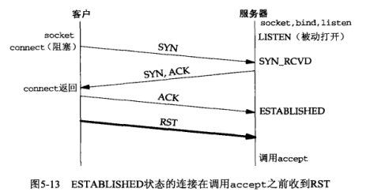

# 第五章 TCP客户服务器程序实例

## 5.1 概述

#### 回射程序时序图


### 代码示例

#### 服务器程序

```c
#include "unp.h"
void str_echo(int sockfd);
int main(){
  int listenfd,connfd;
  pid_t childpid;
  socklen_t clilen;
  struct sockaddr_in cliaddr,servaddr;
  
  listenfd=Socket(AF_INET,SOCK_STREAM,0);
  
  bzero(&servaddr,sizeof(servaddr));
  servaddr.sin_family=AF_INET;
  servaddr.sin_addr.s_addr=htonl(INADDR_ANY);
  servaddr.sin_port=htons(SERV_PORT);
  
  Bind(listenfd,(SA*)&servaddr,sizeof(servaddr));
  
  Listen(listenfd,LISTENQ);
  for(;;){
    clilen=sizeof(cliaddr);
    connfd=Accept(listenfd,(SA*)&cliaddr,&clilen);
    if( (childpid=Fork())==0 ){
      Close(listenfd);
      str_echo(connfd);
      exit(0);
    }
    Close(connfd);
  }
}

void str_echo(int sockfd){
  ssize_t n;
  char buf[MAXLINE];
  
again:
  while( (n=read(sockfd,buf,MAXLINE))>0)
    Writen(sockfd,buf,n);
  if(n<0 && errno==EINTR)
    goto again;
  else if(n<0)
    error_quit("str_echo:read error");
}
```

#### 客户程序

```c
#include"unp.h"
int main(int argc, char** argv){
    int sockfd;
    struct sockaddr_in servaddr;
    if(argc!=2)
        error_quit("usage: tcpcli <IPADDRESS>");

    sockfd=Socket(AF_INET,SOCK_STREAM,0);

    bzero(&servaddr,sizeof(servaddr));
    servaddr.sin_family=AF_INET;
    servaddr.sin_port=htons(SERV_PORT);
    Inet_pton(AF_INET,argv[1],&servaddr.sin_addr);

    Connect(sockfd,(SA*)&servaddr,sizeof(servaddr));

    str_cli(stdin,sockfd);
    exit(0);
}

void str_cli(FILE* fp,int sockfd){
    char sendline[MAXLINE],recvline[MAXLINE];

    while(Fgets(sendline,MAXLINE,fp)!=NULL){
        Writen(sockfd,sendline,strlen(sendline));

        if(Readline(sockfd,recvline,MAXLINE)==0)
            error_quit("str_cli:server terminated");
        Fputs(recvline,stdout);
    }
}
```

### 流程

##### 启动流程

服务器启动 -> socket,bind,listen -> accept(阻塞). 此时，服务器套接字处于LISTEN状态

客户端启动 -> socket -> connect(引发三次握手) -> 服务器accept和客户端connect均返回-> 连接建立

此时，客户端阻塞于fgets调用，服务器fork出子进程，子进程阻塞于read调用，父进程继续循环，并阻塞于accept调用。

##### 中间流程

客户进程fgets->客户端write->服务器read->服务器write->客户端read->客户进程fputs

##### 终止流程

当客户端获取EOF -> fgets返回NULL -> str_cli函数终止 -> 客户端进程终止。

客户进程中描述符被关闭，发出FIN，开始四次挥手。服务器接收FIN，传送EOF给进程并回馈ACK给客户。

服务器进程接受EOF -> read返回0 -> str_echo返回 -> 服务器进程终止。

服务器进程发出FIN。客户接受FIN并回复ACK并进入TIME-WAIT。服务器接受ACK进入CLOSED。

#### 查看网络和进程状态

```netstat``` 查看网络状态, 参数```-a```列出所有, 因为默认不会列出监听套接字

```bash
Proto Recv-Q Send-Q Local Address           Foreign Address         State     
tcp        0      0 *:6666                  *:*                     LISTEN 
```

本例中,使用grep来便于查看:

```bash
tom@pc ~ $ netstat -a | grep 6666
tcp        0      0 *:6666                  *:*                     LISTEN     
tcp        0      0 localhost:6666          localhost:34522         ESTABLISHED
tcp        0      0 localhost:34522         localhost:6666          ESTABLISHED
```

可以看出,一个TCP连接是由本地和远程的网络地址共同指定的.

```ps```命令查看进程信息:

```bash
tom@pc ~ $ ps -t pts/4 -o pid,ppid,tty,stat,args,wchan
  PID  PPID TT       STAT COMMAND                     WCHAN
 4244 12235 pts/4    S+   ./client 127.0.0.1          wait_woken
12235 19209 pts/4    Ss   bash                        wait
```
利用参数```-t```来指定终端, 图形界面下打开的都是伪终端, 可以在使用```tty```来查看当前终端的信息:

```bash
tom@pc ~ $ tty
/dev/pts/4
```
可以看出,系统把终端视作设备.

```ppid```表示该进程的父进程的ID号. 终端启动的进程, 其父进程就是该终端(bash).

使用```ps -a```来查看所有终端下的进程. 此时会忽略bash进程, 如果使用参数```ps a```则会显示bash进程. STAT中S表示睡眠,s表示包含子进程,+表示位于后台,Z表示僵死,R正在运行

```bash
tom@pc ~ $ ps -a -o pid,ppid,tty,stat,args,wchan
  PID  PPID TT       STAT COMMAND                     WCHAN
 4244 12235 pts/4    S+   ./client 127.0.0.1          wait_woken
 4245 31573 pts/1    S+   ./server                    wait_woken
31573 19236 pts/1    S+   ./server                    inet_csk_accept
```

可以用```ps f```或```ps -H```来显示进程父子关系图. 具体请查阅ps的使用.

```WCHAN```表明该进程的(阻塞)状态. 测试发现,等待标准输入的fgets函数和等待网络数据的read函数都是wait_woken状态.(原书叙述的是read_chan和tcp_data_wait)


注: 睡眠的进程即已阻塞的进程.睡眠需要某种条件来唤醒.

### 进程与信号处理

子进程终止时发生SIGCHLD信号给父进程. 父进程必须调用wait或waitpid给子进程收尸，才能正常结束，否则子进程陷入僵死。如果父进程结束，僵死子进程会过继给INIT进程处理。

信号也称软件中断，通常是异步发生的，即进程无法预知信号的产生。信号可以由进程发送另一个进程或内核发送给进程。

进程接受信号并调用处理函数的过程称为捕获。

对信号的处理方法包括：

1. 提供信号处理函数（signal handler）在信号捕获时自动调用。SIGKILL和SIGSTOP不可以被捕获。信号处理函数类型为

   ```c
   void handler(int signo);
   ```

   POSIX中使用sigaction函数用来绑定信号类型和相应的处理函数。

2. 把信号处理设为SIG_IGN来忽略它。SIGKILL和SIGSTOP不可以忽略

3. 设为SIG_DFL启用默认处置。通常为收到信号后进程终止，有些信号是忽略。SIGCHLD和SIGURG的默认是忽略。

#### signal函数

该函数的作用是绑定某种信号到某个处理函数. 这样当进程捕获该信号时,会中断当前进程,进入处理函数,完毕后再返回中断处继续执行.

POSIX中定义sigaction函数，然而较容易的方法是signal函数，它在很多厂家中都提供。如果没有提供，可以自行定义signal函数。

```c
#include "unp.h"
Sigfunc* signal(int signo,Sigfunc *func){
  struct sigaction act,oact;
  
  act.sa_handler=func;
  sigemptyset(&act.sa_mask);
  act.sa_flags=0;
  if(signo==SIGALRM){
    #ifdef SA_INTERRUPT
    act.sa_flags |= SA_INTERRUPT;
    #endif
  }else{
    #ifdef SA_RESTART
    act.sa_flags |= SA_RESTART;
    #endif
  }
  if(sigaction(signo,&act,&oact)<0)
    return (SIG_ERR);
  return (oact.sa_handler);
}
```

- 第一个参数为信号名，第二个参数为指向处理函数的指针或SIG_IGN或SIG_DFL常值。

- 函数signal的原型因为层次太多所以很复杂

  ```c
  void (*signal(int signo,void (*func)(int))) (int);
  ```

  为了简便起见，定义`typedef void Sigfunc(int);`

- 设置处理函数

  sigaction结构中的sa_handler被设置为func参数

- 信号掩码

  信号的掩码表示某些信号在处理函数被调用期间不会被递交给进程。可以设置sa_mask为空，代表该信号函数运行期间，不阻塞额外类型的信号。信号在被处理函数执行期间，同种信号被阻塞。

- SA_RESTART标志

  该标志可选。信号捕获时，进程会中断进入信号处理函数。如果设置，则内核会自动重启被中断的调用。如果系统支持SA_RESTART，我们对非SIGALRM信号设置该标志。SIGALRM通常是为IO操作设置超时使用，一般目的在于中断调用。早期系统默认自动重启并定义了互补的SA_INTERRUPT标志。此时我们就在SIGALRM时设置它。

#### POSIX信号语义

- 一旦安装了信号处理函数，则一直安装着。
- 信号只是单一的整形数值,无法确定信号源. 
- 信号有不同种,但是同种信号可能产生多个. 同种信号会相互阻塞,即进程捕获到了一个SIGCHLD进行处理的时候,后续的SIGCHLD信号会被自动忽略掉,不会被递交或排队.
- 某个信号处理函数运行期间，同种信号或sa_mask指定的信号会被阻塞。
- 如果一个信号在被阻塞期间产生了一次或多次，那么信号被解阻塞后通常只递交一次，即信号默认不排队。
- sigprocmask可以选择性地阻塞或解阻塞一族信号。这使得可以在一段临界区代码执行期间防止捕获某些信号，以保护这段代码
- 大多数系统实现了自己的signal函数,此时再定义signal函数会重定义. 我们自己编写的signal函数被认为和系统的实现是等效的.

### 5.9 处理SIGCHLD信号

设置僵死状态的目的是维护子进程的信息，以便于父进程在以后某个时刻获取。

SIG_CHLD更像是一种通知: 通知父进程它有子进程终止, 是时候调用wait或waitpid来清理了.

定义信号处理函数

```c
void sig_chld(int signo){
  pid_t pid;
  int stat;
  pid=wait(&stat);
  printf("child %d terminated.",pid);
}
```

因为信号是给父进程的，所以必须在fork前写入`Signal(SIGCHLD,sig_child)`来进行绑定，且只绑定一次。

> 信号处理函数中不宜调用printf这样标准IO函数

某些调用可能阻塞很长时间，如accept, 系统IO等(例外是磁盘IO). 当进程阻塞于此类调用时被信号中断,那么这个慢调用可能返回EINTR错误. 

子进程终止时父进程阻塞于accept，SIGCHLD信号递交时，父进程会中断。此时accept调用会返回EINTR错误。

在编写健全的程序时，通常需要对被中断的慢调用进行处理。某些系统环境下的signal函数不会让内核自动重启被中断的调用，即SA_RESTART没有被设置。有些系统环境会自动重启。

某些系统不支持SA_RESTART标志，即使有，也不保证所有中断都可以自动重启。

慢系统调用可适用于那些可能永远阻塞的系统调用。例如对管道和终端设备的读写。一个例外是磁盘IO，通常立即返回。

为了保证移植性，通常在慢调用外围加循环或用goto来实现自重启。此时accept不应该使用包裹函数，因为我们需要做特别处理

```c
for(;;){
  chilen=sizeof(cliaddr);
  if( (connfd=accept(listenfd,(SA*)&cliaddr,&clilen))<0){
    if(errno==EINTR)
      continue;
    else
      err_sys("accept error");
  }
  break;
}
```

对于accept read write select open之类的函数，重启是合适的。但是connect例外，如果不能被内核自动重启，那么也不能被进程重启，它被中断后必须使用select来等待连接完成。

### wait和waitpid函数

```c
#include<sys/wait.h>
pid_t wait(int *statloc);
pid_t waitpid(pid_t pid,int* statloc, int options);
	均返回：若成功则为进程ID，否则-1
```

返回已终止子进程的ID号，以及通过statloc指针返回终止状态。

wait函数被调用时，若有终止的子进程，则会进行处理；如果当前没有已终止的子进程，不过有存在子进程在运行，则会阻塞到某个子进程终止为止。

waitpid可以指定特定的子进程，或-1表示等待任意子进程。其次可以有附加选项，WNOHANG表示不阻塞

##### wait函数的局限性

假设当前服务器连接了5个客户端，客户端在几乎同一时刻终止，则服务器的5个子进程几乎在同一时刻终止，5个SIGCHLD被递交给父进程。某个信号触发了处理函数，在处理函数运作其间，后续的信号被阻塞。所以不是每个信号都得到了妥善处理。

可以使用waitpid搭配非阻塞和循环来完成。

```c
void sig_child(int signo){
  pid_t pid;
  int stat;
  while( (pid=waitpid(-1,&stat,WNOHANG))>0)
    printf("child %d over.",pid);
}
```

当某个信号触发处理函数后，处理函数会不断地搜索现有已终止子进程，并逐次进行处理。当搜索不到已终止子进程时会返回。因为设置非阻塞，所以每轮搜索会很快。这样的话，可以应对（几乎）同时到达的多个信号。

收到信号时,意味着有子进程终止,但是不能确定其数目. 所以使用一个循环,处理现有的终止子进程,直至无终止子进程为止. 

因为wait函数在无僵死子进程时会阻塞, 所以不能用于循环中.

##### 服务器程序最终版本

- 信号及处理函数
- accept手动重启
- waitpid函数

```c
#include "unp.h"
void str_echo(int sockfd);
void sig_chld(int signo);
int main(){
    int listenfd,connfd;
    pid_t childpid;
    socklen_t clilen;
    struct sockaddr_in cliaddr,servaddr;
    void sig_chld(int);

    listenfd=Socket(AF_INET,SOCK_STREAM,0);

    bzero(&servaddr,sizeof(servaddr));
    servaddr.sin_family=AF_INET;
    servaddr.sin_addr.s_addr=htonl(INADDR_ANY);
    servaddr.sin_port=htons(SERV_PORT);

    Bind(listenfd,(SA*)&servaddr,sizeof(servaddr));

    Listen(listenfd,LISTENQ);

    Signal(SIGCHLD,sig_chld);
    for(;;){
        clilen=sizeof(cliaddr);
        if( (connfd=accept(listenfd,(SA*)&cliaddr,&clilen))<0){
            if(errno==EINTR)
                continue;
            else
                error_quit("accpet error");
        }
        if( (childpid=Fork())==0){
            Close(listenfd);
            str_echo(connfd);
            exit(0);
        }
        Close(connfd);
    }
}
void str_echo(int sockfd){
    ssize_t n;
    char buf[MAXLINE];

    again:
    while( (n=read(sockfd,buf,MAXLINE))>0)
        Writen(sockfd,buf,n);
    if(n<0 && errno==EINTR)
        goto again;
    else if(n<0)
        error_quit("str_echo:read error");
}
void sig_chld(int signo){
    pid_t pid;
    int stat;
    while( (pid=waitpid(-1,&stat,WNOHANG))>0)
        printf("child %d over.",pid);
}
```

### 通信意外

#### accept返回前连接终止

accept函数除了被信号中断外，还有可能被以下错误中断。此时只需再次调用accept即可

在三次握手时，服务器在listen之后，不需accept即可接受SYN。三次握手完毕后，可能在某些情况下，客户发出RST



不同的实现处理不同。源于Berkeley的实现在内核处理，进程不可见。SVR4返回错误给进程作为accept的返回结果，某些返回EPROTO。POSIX规定返回ECONNABORTED

#### 服务器子进程终止或崩溃

此处的终止指的是进程自行结束或者被系统杀死。

1. SIGCHLD被父进程捕获并正常处理

2. 服务器子进程终止 -> 描述符关闭 -> 发送FIN -> 客户响应ACK。

   此时客户响应ACK是内核自动完成的，客户进程还阻塞在fgets上

   此时前两次挥手已经完成。此时服务器端套接字状态为FIN_WAIT2

   重申：套接字不隶属于进程。进程结束了，套接字还在，它接受了FIN_ACK转为了FIN_WAIT2状态

3. 客户接受标准输入，并发送至对端。允许写入一个已经接收FIN的套接字端口。

4. 服务器接受报文，但是没有进程来操作套接字，因此回复RST

5. 客户在调用write后立即调用read，此时FIN已被接受，read会读到EOF并返回0。客户终止，关闭描述符。

测试发现，服务器进程终止后，完成两次挥手，服务器处于FIN_WAIT2状态，客户端处于CLOSE_WAIT状态。如果此时客户端不做任何操作，那么服务器的经过数十秒后自动关闭，客户端依然维持CLOSE_WAIT状态。如果客户端接收标准输入并发送数据，会接收对方的RST，此时双方均会在短时间内关闭，没有后两次挥手，不存在TIME_WAIT状态。

进程并不察觉接受到了RST，RST是很重要的分节。

本例中问题在于，对方发出FIN时，本方阻塞在fgets上，不能实时察觉和响应。

注意

允许写入一个已经接收FIN的套接字端口。对方发送FIN表示不再发送，但是可以继续接收。然而，FIN通常是调用close触发的，不允许对close的套接字进行读写。因而半关闭状态下不能做平常的数据交互。

> 客户调用read如果在收到RST之前，则返回EOF；若之后，则返回ECONNRESET错误。

#### SIGPIPE信号

当进程向某个已收到RST的套接字接口执行写操作时，内核向进程发送SIGPIPE信号，默认行为是终止进程。如果不期望，可以绑定处理函数来自行处理。但无论捕获信号还是忽略信号，写操作都会引发EPIPE错误。

这种错误难以主动察觉，例如需要连续两次写入数据到套接字。第一次写入触发了RST，第二次写入就会引发错误。

写一个已接收FIN的套接字接口合法；但是RST会是错误。

处理SIGPIPE如果没有特别的事情可做，可设为SIG_IGN，并假设后续的write捕捉到EPIPE并终止。

注意：如果使用多个套接字，将无法确认是哪个出的错。如果需要得知，则必须忽略SIGPIPE并从write返回错误处进行判断。

#### 服务器主机崩溃

主机崩溃不是系统关闭，主机崩溃时无法发送FIN

客户发送数据时，因为得不到对方确认，会重发数次直至失败，并返回错误给进程。(但是write是调用成功，因为它仅仅表示拷贝进入发送缓存区。)数据不可达的错误返回进程时，进程在read调用上，将返回一个错误ETIMEDOUT（数据到达主机时无应答）或EHOSTUNREACH/ENETUNREACH（在某路由上被判定不可达）

可以给read设定一个超时来改善。

只有向服务器主动发送数据并根据回馈才能检测到连接断开。SO_KEEPALIVE选项用于自动检测

#### 主机崩溃重启

主机崩溃后客户无法得知。主机重启后，客户发送数据，主机没有进程来处理该套接字的数据，会回复RST。即使重启后主机建立了相同的监听套接字，也会因数据报文不属于任何一个已建立的连接而回复RST。

此时客户正read，返回CONNRESET错误。

#### 服务器主机关机

关机时，Init进程给所有进程发送SIGTERM信号，该信号可被捕获(并用于自行处理和终止进程)；等待5-20秒后发送SIGKILL(不能捕获)并终止进程。此时情况同“服务器进程终止”的情况。

#### 主动与被动得知

服务器崩溃后,客户端无法被动得知,只能主动发送数据"试探",从返回的结果得知.如果想被动得知,参考SO_KEEPALIVE套接字选项.

### 数据格式

#### 文本串

支持性极好，因为字节流和文本串有直接对应关系。传输模型如同管道,所以文本会忠实地传送并还原.


#### 二进制结构

非文本串的数据类型以字节流传输，不保证准确还原

##### 因素包括

- 存储格式的不同：例如大端模式小端模式
- 数据类型的不同: 例如32位和64位的long类型是不同的
- 结构打包的不同: 
  - 浮点数的精度
  - 数据的位数
  - 结构体的对齐方式

##### 解决方法

- 字符串形式传送
- 显式规定格式


### 关于习题

##### 标准输入重定向到二进制文件

二进制文件有值为零的字节，被字符串认为是结束符`\0`。读入时使用了fgets，它以换行符为结尾读入文本，此时可能读入中间位置含有`\0`的字符数组。

在发送时使用了strlen，此时会以结束符为基准计算长度，从而得到错误的字符串长度。所以发送内容少于预期。

为了避免上述错误，可以不使用strlen，而是预先记录fgets读取长度然后据此发送数据。

##### fgets介绍
- 从文件读取数据,直到换行符为止(读入换行符),但每次最多读取bufsize-1个字符（第bufsize个字符赋'\0'）.
- 如若该行（包括最后一个换行符）的字符数超过bufsize-1,则fgets只返回一个不完整的行.对fgets的下一次调用会继续读该行。
- 函数成功将返回buf，失败或读到文件结尾返回NULL。因此我们不能直接通过fgets的返回值来判断函数是否是出错而终止的，应该借助feof函数或者ferror函数来判断。
- 如果读取的是二进制文件,那么可能会读取到'\0'这样的数据,这样对读取到的字符串的常规操作(如strlen)会发生错误.

##### 服务器进程终止和主机崩溃时的四次挥手情况

服务器进程终止，会完成前两次挥手，此时服务器处于FIN_WAIT2状态，客户端处于CLOSE_WAIT状态。此时客户端发送对话数据，由于找不到进程处理连接，服务器会回馈RST，此时双方都会终止连接，不存在后两次握手。

主机崩溃时，来不及四次挥手，连接就会消失。此时客户端的对话数据会得到超时或不可达的错误。

假设主机崩溃后重启，然后客户端发送对话数据，此时服务器没有进程处理连接，返回RST错误。即使有进程来建立监听套接字，也会因收到不属于已存在连接上的数据而返回RST

##### 关于目的接口和到达接口

弱端系统模型的服务器, 只要客户端指定其IP地址之一,就可以正确建立TCP连接. 报文的到达接口不一定是目的接口. 


建立的TCP连接绑定的是目的接口.

这一切由系统自动完成,相当于从到达接口和目的接口创建了一条通路.

##### 不同系统的数据传送

如果服务器和客户端分别是大端模式和小端模式，客户发送两个小整数，服务器接收并相加，然后返回结果。此时发现结果是正确的，为什么？

小端模式下1和2分别为[01,00]和[02,00] (简便起见只留16位),传送过去，对面看来是两个较大的数值，但是相加后的结果为[03,00],传送回来的数据是正确的。假如数据比较大，相加后有高字节的进位，后者会误认高低字节而产生错误。两个小负数相加也会发生上述情况。

上述现象是为了说明字节式的数据传输不可靠，但特殊情况下看起来是正确的。

##### 能否使用字节顺序转换函数htonl和ntohl来实现数据传送

原理可行，但是注意这些函数中的l指的是32位的值，和系统的长整形可能不一致。

#### 关于信号的阻塞

原书说明，解阻塞的信号通常只会递交一次。

简单上认为，进程上对每个信号都有一个信号槽，当信号到达信号槽时被捕获，此时信号槽为空，后续的同种信号只能塞一个信号到信号槽内，后续的信号被丢弃。

测试发现，如果在服务器信号处理函数加入一个10s的延时，建立多个客户连接并手动迅速关闭。此时发现有两个子进程被正确处理，其他进程僵死。

所以可能性比较大的情况就是：阻塞期间信号不会送达，但是有一个信号卡在信号槽内，其他信号被丢弃。

而书本上说，可能只有1个子进程正确处理。所以此处存疑。