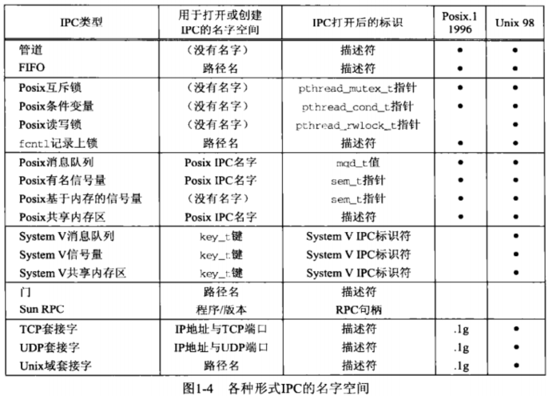

# 第1章 简介

## 1.1 概述

IPC是进程间通信(interprocess communication)的简称。

> 两进程有亲缘关系(related)的说法意味着它们有共同祖先，或者某进程是另一个进程的祖先。

## 1.2 进程、线程与信息共享
每个进程都有各自的地址空间。下图表示了进程间共享信息的三种模式。


三种模式简略描述如下：

1. 通过文件来共享数据，每个进程需要穿越内核去访问文件。当文件有待更新时，需要某种形式的同步以进行访问保护。
2. 通过内核进行消息传递，内核进行消息调度，不需显式的同步，例如管道。相关操作涉及对内核的系统调用。
3. 通过共享内存区来共享数据，可以不涉及内核而访问其中的数据，需要某种形式的同步以进行访问保护。

#### 线程

一个进程中所有线程共享全局变量，所以可以视为共享内存模型，全局变量作为共享内存区的内容，被各个线程所访问。因而线程间需要某种形式的同步。

## 1.3 IPC对象的持续性

持续性表明了对象的存活期。

1. 随进程持续：IPC对象存活至打开着该对象的最后一个进程关闭该对象为止。 例如管道和FIFO。    
2. 随内核持续：IPC对象存活至内核重新自举或显式删除该对象为止。 例如SystemV的消息队列、 信号量和共享内存区就是此类。 Posix的消息队列、信号量和共享内存区至少是随内核持续的，也可以是随文件系统持续的，具体取决于实现。
3. 随文件系统持续：IPC对象存活到显式删除该对象为止。即使内核重新自举，该对象还是保持原值。Posix的消息队列、信号量和共享内存区如果是使用映射文件实现的（不是必需条件），那么它们就是随文件系统持续的。

注意：IPC对象本身的模型和持续性并无绝对关系。例如管道内的数据是在内核中维护的，但管道随进程持续。最后一个将某管道打开着用于读的进程关闭该管道后，内核会关闭该管道并清除数据。类似地，尽管FIFO在文件系统中有名字， 但其随进程持续。最后一个将某个FIFO打开着的进程关闭该FIFO后，FIFO中的数据都被丢弃。

下表列出了各IPC对象的持续性


注意：

- 表中没有IPC类型具备随文件系统的持续性，但是有三种类型的Posix IPC可能会具备该持续性， 这取决于它们的实现。
- 对于一种给定形式的IPC, 要求它具备随文件系统的持续性可能会使其性能降级, 这违背了IPC的高性能设计需求。
- 多数形式的IPC并没有在系统重新自举后继续存在的打算， 因为进程不可能跨越重新自举继续存活。

## 1.4 名字空间

名字用于标识一个特点的IPC对象，这在无亲缘的进程间通信是必要的。

IPC对象合法的名字集合称为名字空间。

以下汇总了不同类型IPC的命名约定。注意其中套接字API是Posix.1g工作组标准化的。



有些IPC依然是可选的特性，下表汇总了各种IPC特性的说明。每种特性有强制、 未定义和可选三种选择。 对于可选的特性， 我们指出了受支持时（通常在unistd.h头文件中）定义的常值的名字。注意，Unix98是Posix.l的超集 。


## 1.5 fork、exec和exit对IPC对象的影响

我们需要理解 fork、exec和_exit函数对于各种IPC的影响（_exit是由exit调用的函数）。下表对此做了总结。


强调的问题如下：

- 首先， 无名同步变量(互斥锁、条件变量、读写锁、基于内存的信号量)从一个具有多个线程的进程中调用fork将变得混乱不堪。[Butenhof 1997]的6.1节提供了其中的细节。 
  表中只是简单地注明：如果这些变景驻留在共享内存区中，并设置了进程间共享属性，那么对于能访问该共享内存区的任意进程来说，其任意线程能继续访问这些变量。 
- 其次， System V IPC的三种形式没有打开或关闭的说法。访问这三种IPC所需知道的只是一个标识符， 因此知道该标识符的任何进程都能访问它们，尽管信号量和共享内存区可附带提出某种特殊处理要求。    

## 1.6 出错处理：包裹函数

包裹函数用于自行检查某函数是否返回错误，并在出错时执行默认操作(通常为终止进程)。

此外，包裹函数可以执行某些附加操作。例如，某些线程函数在出错时并不设置errno变量，所以我们在对应包裹函数中设置errno，以便查询出错信息。

```c
int Pthread_mutex_lock(pthread_mutex_t *mptr){
	int res;
    res = pthread_mutex_lock(mptr);
    if(res!=0){
    	errno = res;
        error_quit("pthread_mutex_lock error");
    }
    return res;
}
```

包裹函数的意义在于缩短代码量，同时检查易被忽略的函数返回值。所以我们尽量使用包裹函数，除非需要对函数出错的情况做特定处理。

#### Unix errno值

典型情况下，Unix函数出错时返回-1，errno被置为指示错误类型的某个EXXX常值。

如果函数不返回错误，那么errno的值无意义。

在多线程环境中，每个线程必须拥有各自的errno变量。指定-D_REENTRANT或 -D_POSIX_C_SOURCE=199506L编译选项是较典型的方法。系统往往把errno定义成一个宏， 当常值-D_REENTRANT有定义时，该宏就扩展成一个函数，由它访问各线程的errno变量副本。 

全书使用类似 “某函数返回EXXX错误”的用语来简略地表示这样的意思：函数返回一个错误（典型返回值是-1),并且在errno中设置EXXX常值。

## 1.7 Unix标准（略）

## 1.8 书中IPC例子索引表(略)

## 习题

问：上文我们展示了两个进程访问单个文件的情形。如果这两个进程都只是往该文件的末尾添加新的数据（例如这是一个日志文件），那么需要什么类型的同步？    

答：打开文件时指定追加模式O_APPEND即可(或用fopen指定追加模式)。UNIX环境高级编程中关于原子操作的介绍，如果多个进程都需要将数据添加到某一文件，那么为了保证定位和写数据这两步是一个原子操作，需要在打开文件时设置O_APPEND标志。 

思考：
- write操作时，如果对象是一个文件，只要数据长度不超过一定大小，则可以认为是原子的，否则可能取决于实现。（来源：网络查询）
- 如果必须在同一个文件中记录多个进程产生的数据，建议采用unix日志系统采用的方法，用一个专用进程处理文件IO，其它进程把数据发送给专用进程，这样应该比多个进程同时写文件可靠和高效。
- 当write一个管道时，unp2书中明确指出长度在PIPE_BUF以内是原子的。
- 当write一个socket时，不能保证是原子的。(来源:网络查询)


