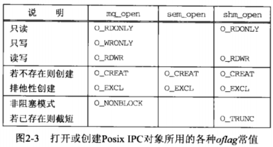
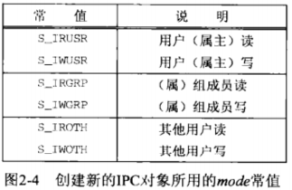
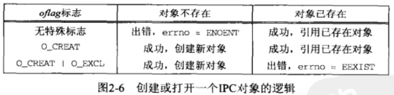

# 第2章 Posix IPC

## 2.1 概述

以下三种类型的IPC合称为 “Posix IPC”：
- Posix消息队列(第5章)
- Posix信号量(第10章)
- Posix共享内存区(第13章)

Posix IPC在访问它们的函数和描述它们的信息上有一些类似点。本章讲述所有这些共同属性：用于标识的路径名、打开或创建时指定的标志以及访问权限。


## 2.2 IPC 名字

三种类型的Posix IPC都使用“Posix IPC名字”进行标识，mq_open、sem_open和shm_open的第一个参数就是IPC名字。

IPC名字可能是文件系统中的一个真正的路径名，也可能不是。

Posix. 1是这么描述PosixIPC名字的：

- 它必须符合已有的路径名规则（最多由PATH_MAX个字符构成，包括结尾的空字符）。
- 如果它以斜杠符开头，那么对这些函数的不同调用将访问同一个队列(即：类似于绝对路径)。如果它不以斜杠符开头，那么效果取决于实现(即：类似于相对路径)。
- 名字中额外的斜杠符的解释由实现定义。

因此，为便于移植起见，Posix IPC名字必须以一个斜杠符打头，并且不能再含有任何其他斜杠符。遗憾的是这些规则还不够，不同系统的实现可能不同, 因而出现移植性问题。

例如：IPC名字为/test的消息队列，Solaris2.6会创建类似“/tmp/MQ.test”名称的文件，BSD4.4会创建/test文件。

当我们指定一个只有单个斜杠符打头的名字时（例如/test)，移植性问题就发生了：我们必须在根目录中具有写权限。因为有些实现会把名字视作文件名，会试图创建这个文件。这时除非拥有在根目录中的写权限，否则这样的尝试将失败。如果我们指定 /tmp/test 这样的名字，那么以该名字创建一个真正文件的系统都将成功（前提是/tmp目录存在，且在该目录中有写权限，这对于多数Unix系统来说是默认成立的），在Solaris下则失败，因为后者规定只能含有打头的斜杠符。

即：在Solaris下需为/test，在BSD下需为/tmp/test.

为避免这些移植性问题，我们把Posix IPC名字的#define行放在一个便于修改的头文件中，这样应用程序转移到另一个系统上时，只需修改这个头文件。

> 这是一个折衷的方法，以修改部分文件的代价，实现各系统上的通用。在Posix中称为 “造成不标准的标准方式 ”（a standard way of being nonstandard)

Posix. 1定义了三个宏：S_TYPEISMQ、S_TYPEISSEM、S_TYPEISSHM判断指定的IPC对象的类型信息。但不幸的是，这三个宏没有多大用处，它们仅在IPC对象使用某种独特的文件类型实现时有效。例如在Solaris 2.6下这三个宏的计算结果总是0.

#### px_ipc_name 函数

解决上述移植性问题的另一种办法是自己定义一个名为px_ipc_name的函数，它为定位Posix IPC名字而添加上正确的前缀目录。

```c
#include "unpipc.h"
char *px_ipc_name(const char * name);
返回：若成功则为非空指针.若出错则为NULL
```

注意： name参数中不能有任何斜杠符。

例如，调用`px_ipc_name(“/test")`在Solaris 2.6下应返回一个指向字符串/test的指针，在Digital Unix 4.0B下应返回一个指向字符串/tmp/test的指针。存放结果字符串的内存空间是动态分配的，并可通过调用free释放（注：笔者不建议）。另外环境变景PX_IPC_NAME能够覆盖默认前缀目录。

该函数的实现如下。

```c
char *px_ipc_name(const char *name){
	char	*dir, *dst, *slash;
	if ( (dst = malloc(PATH_MAX)) == NULL)
		return(NULL);

	/* can override default directory with environment variable */
	if ( (dir = getenv("PX_IPC_NAME")) == NULL) {
#ifdef	POSIX_IPC_PREFIX
		dir = POSIX_IPC_PREFIX;		/* from "config.h" */
#else
		dir = "/tmp/";				/* default */
#endif
	}
	/* dir must end in a slash */
	slash = (dir[strlen(dir) - 1] == '/') ? "" : "/";
	snprintf(dst, PATH_MAX, "%s%s%s", dir, slash, name);

	return(dst);			/* caller can free() this pointer */
}
// code 2-2
```

## 2.3 创建与打开IPC通道

mq_open、 sem_open和shm_open这三个函数创建或打开一个IPC对象，它们的名为oflag的第二个参数指定怎样打开所请求的对象。这与标准open函数的第二个参数类似。下图给出了可组合构成该参数的各种常值。

前3行指定怎样打开对象： 只读、 只写或读写。 消息队列能以其中任何一种模式打开，信号量的打开不需指定任何模式（信号量操作需要读写，因此默认需要读写访问权），共享内存区对象则不能以只写模式打开。



上表中最后四行是可选的，描述如下：

1. O_CREAT（可创建）

	若目标对象不存在，则创建新对象。

	在创建新对象时，需要另外一个mode参数指定权限，它是由以下常值按位或形成的。这些常值定义在`<sys/stat.h>`中。

	

	所指定的权限位受当前进程的“文件模式创建掩码”(file mode creation mask)修正，而该掩码可通过调用umask函数或使用shell的umask命令来设置。

	跟新创建的文件一样，当创建一个新的消息队列/信号量/共享内存对象时，其用户ID被置为当前进程的有效用户ID。信号量或共享内存区对象的组ID被置为当前进程的有效组ID或某个系统默认组ID。新消息队列对象的组被置为当前进程的有效组ID.

	> 这三种IPC在设置组ID上存在的差异多少有点奇怪。由open新创建的文件的组ID或者是当前进程的有效组ID， 或者是该文件所在目录的组ID.但是IPC函数不能假定系统为IPC对象创建了一个在文件系统中的路径名。

2. O_EXCL （限定创建）

	该标志通常和O_CREAT搭配使用。简单来说，它限定了O_CREAT的作用仅为"创建新对象"。此时期望创建新对象，如果该对象己经存在则返回SEXIST错误。

	考虑到其他进程的存在， 检查指定IPC对象的存在与否和创建它（如果它不存在）这两步必须是原子的。

3. O_NONBLOCK （非阻塞）

	该标志使得消息队列在"队列为空时的读"与"队列填满时的写"不被阻塞。

4. O_TRUNC （截断）

	如果以读写模式打开了一个已存在的共享内存区对象，那么该标志将使得该对象的长度被截成0。

#### 创建流程和逻辑图




## 2.4 IPC权限

当xxx_open函数打开一个已存在的IPC对象时（或者未指定O_CREAT, 或者指定了O_CREAT但没有指定O_EXCL, 同时对象已经存在）, 将基于如下信息执行权限测试：

1. 创建时赋予该IPC对象的权限位；
2. 所请求的访问类型（O_RDONLY、 O_WRONLY或O_RDWR);
3. 调用进程的有效用户ID、有效组ID以及各个辅助组ID (若支持的话）。

大多数Unix内核按如下步骤执行权限测试：

1. 如果当前进程的有效用户ID为0 (超级用户）， 那就允许访问。

2. 在当前进程的有效用户ID等于该IPC对象的属主lD的前提下， 如果相应的用户访问权限位已设置， 那就允许访问， 否则拒绝访问。
> 这里相应的访问权限位的意思是： 如果当前进程为读访问而打幵该IPC对象， 那么用户读权限位必须设置； 如果进程为写访问而打开， 那么用户写权限位必须设置。

3. 在当前进程的有效组ID或它的某个辅助组ID等于该IPC对象的组ID的前提下， 如果相应的组访问权限位己设置， 那就允许访问， 否则拒绝访问。

4. 如果相应的其他用户访问权限位已设置，那就允许访问，否则拒绝访问。

这4个步骤是按所列的顺序尝试的。 例如，如果当前进程拥有该IPC对象（第2步），那么访问权是否授予只依赖于用户访问权限，组访问权限绝不会考虑。

## 习题

2.1 使用Posix IPC的程序，其SUID与SGID位（APUE的4.4节）是如何影响权限测试的？

答：这两位能改变待运行程序的有效用户ID和/或有效组ID。

2.2 当一个程序打幵一个Posix IPC对象时，如何判定是创建了新对象还是在引用己有对象？

答：先同时指定O_CREAT和O_EXCL,如果成功则创建了新对象；若返回EEXIST则证明对象已存在，此时可以重新调用open打开文件（不指定O_CREAT和O_EXCL).但是第二次调用失败并返回ENOENT错误的机会仍然存在（尽管很小），它表明在这两次调用之间，另外某个线程或进程已将该对象删除了。
