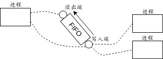

# 第4章 管道和FIFO

## 4.1 概述

管道没有名字，不能在无亲缘进程间通信。FIFO有名字（也称有名管道），弥补了这个不足。

## 4.2 一个简单的客户-服务器例子

工作模式如下：

1. 客户端从标准输入读入路径名，传给服务器；
2. 服务器按路径名去读取目标文件内容，传回客户端。
3. 客户端接收内容并输出。


## 4.3 管道

由pipe函数创建，提供单向数据流。

```c
#include<unistd.h>
int pipe(int fd[2]);
返回：成功则0，出错-1
```

该函数返回两个文件描述符，fd[0]和fd[1].前者用来读，后者用来写。

> 有的系统提供全双工管道。创建全双工管道的另一种方法是使用socketpair函数。

宏S_ISFIFO可用于确定一个描述符是管道还是FIFO。

#### 管道的逻辑结构与父子进程间的通信

管道通常是亲缘进程间通信的手段，在父子进程通信过程如下：


1. 父进程创建管道后fork产生自身的副本。
2. 父进程关闭管道读出端，子进程关闭写入端。此时管道提供了父到子的单向数据流。

注意：如果父子需要双向通信，则创建两条管道即可。

思考：从原书的图示来看，管道中的数据应该是在内核中维护的。对管道的操作需要直接通过内核。

#### shell与管道

管道可用于shell。在shell输入` who | sort | lp `命令时，系统创建三个进程和其间的两个管道，每个管道的读出端接入到相应进程的标准输入，写入端接入相应进程的标准输出。


#### 例子

父子进程之间建立两条管道用于双向通信。父进程读取标准输入传递给子进程，子进程按文件名读取文件，传送给父进程。子进程作为服务器，父进程作为客户端。

#### 主程序

```c
#include "unp.h"
void client(int,int),server(int,int);
int main(){
    int pipe1[2],pipe2[2];
    pid_t childpid;
    Pipe(pipe1);
    Pipe(pipe2);

    if( (childpid=Fork()) ==0 ){
        Close(pipe1[1]);
        Close(pipe2[0]);
        server(pipe1[0],pipe2[1]);
        exit(0);
    }
    Close(pipe1[0]);
    Close(pipe2[1]);
    client(pipe2[0],pipe1[1]);

    Waitpid(childpid,NULL,0);
    exit(0);
}
```

#### client函数

```c
void client(int readfd,int writefd){
    size_t len;
    ssize_t n;
    char buff[MAXLINE];

    Fgets(buff,MAXLINE,stdin);
    len=strlen(buff);
    if(buff[len-1]=='\n')
        len--;
    Write(writefd,buff,len);
    while( (n=Read(readfd,buff,MAXLINE))>0 )
        Write(STDOUT_FILENO,buff,n);
}
```

#### server函数

```c
void server(int readfd,int writefd){
    int fd;
    ssize_t n;
    char buff[MAXLINE];
    if( (n=Read(readfd,buff,MAXLINE))==0)
        error_quit("EOF while reading pathname");
    buff[n]='\0';
    if( (fd=open(buff,O_RDONLY)) < 0){
        snprintf(buff+n,sizeof(buff)-n,": cannot open %s\n", strerror(errno));
        n=strlen(buff);
        Write(writefd,buff,n);
    }else{
        while( (n=Read(fd,buff,MAXLINE))>0)
            write(writefd,buff,n);
        Close(fd);
    }
}
```

##### 子进程僵死与信号处理

子进程终止后变为僵死进程，此时内核向父进程发送SIGCHLD信号。父进程接收信号并处理子进程，从而解除其僵死状态。若父进程未处理，而是直接终止，则子进程被托付给init进程处理。

##### 从文件中读取一行：fgets

用法：`char *fgets(char *buf, int N, FILE *stream);`

从文件中读取至多N-1个字符存入缓冲区，并填充结束符。如果N-1个字符中包括换行符，则截至换行符(含换行符)存入缓冲区，其他部分保留在文件中。

函数成功将返回buf，失败或读到文件结尾返回NULL。NULL无法判断是否由出错而终止，应借助feof函数或ferror函数来判断。

##### 读取管道

对管道的读取：当管道有可用数据后read会立即返回。

## 4.4 全双工管道

管道的数据结构类似于单向队列：向尾部写入数据并从头部取出数据。

某些系统提供全双工管道：SVR4的pipe函数和许多内核都提供的socketpair函数。全双工管道实际是两条半双工管道的组合。


要点
- 每条半双工管道都有独立的缓冲区，读写操作类似于队列的存取操作。
- 双向管道的每一端，都可以执行读写操作。

注意：并非所有系统都支持双向管道。此时read操作的对象只能是fd[0]，如果是fd[1]会产生EBADF错误，即错误的文件描述符。write操作同理。

## 4.5 popen和pclose函数

popen创建管道并启动另外一个进程，该进程要么从管道读出标准输入，要么往管道写入标准输入。类似于重定向操作。

```c
#include<stdio.h>
FILE* popen(const char* command, const char* type);
返回：成功则为文件指针，出错为NULL
int pclose(FILE* stream);
返回：成功则为shell的终止状态，出错为-1
```

其中command是一个命令行，它是由sh程序(通常为Bourne shell)处理的，因此PATH环境变量可以定位command。popen在进程与命令行之间创建一个管道。

type参数决定了管道连接方式。如果为“r”，那么进程读取命令行的标准输出；如果为“w”，则进程写至命令行的标准输入。

pclose函数关闭popen创建的流，等待命令执行终止，返回shell的终止状态。

例子：
```c
int main(){
    size_t n;
    char buff[MAXLINE],command[MAXLINE];
    FILE* fp;
    Fgets(buff,MAXLINE,stdin);
    n=strlen(buff);
    if(buff[n-1]=='\n')
        n--;
    snprintf(command,sizeof(command),"cat %s",buff);
    fp=Popen(command,"r");
    while(Fgets(buff,MAXLINE,fp)!=NULL)
        Fputs(buff,stdout);
    Pclose(fp);
    exit(0);
}
```

注意：cat程序把出错消息写到标准错误输出，但popen仅对标准输出做重定向。这意味着无法获取完整的错误信息。

## 4.6 FIFO

FIFO也称有名管道。类似于管道，它也是单向的。但它有名字，因而可用于非亲缘进程间。

FIFO由mkfifo函数创建。

```c
#include<sys/types.h>
#include<sys/stat.h>
int mkfifo(const char* pathname, mode_t mode);
返回：成功则0，出错-1
```

要点
- 参数pathname是一个普通的Unix路径名，它是该FIFO的名字。
- 参数mode指定文件权限位，类似于open的第二个参数。
- 函数mkfifo隐含O_CREAT|O_EXCL。即：它期望创建新FIFO。若FIFO已存在，则返回EEXIST错误。若期望打开已存在的FIFO，则应使用open。
- 可以先使用mkfifo，如返回错误，则改用open。

mkfifo也是命令，可从shell中使用。

在创建出一个FIFO后，它必须或者打开来读，或者打开来写；所用的可以是open函数，也可以是某个标准IO函数如fopen来打开。FIFO不能既打开来读又打开来写，因为它是半双工的。

对管道和FIFO的write向末尾添加数据，read从开头取出数据。如果对它调用lseek则返回ESPIPE错误。

#### 例子：父子进程间使用FIFO

改用FIFO代替两个管道。client和server函数不需变动。

```c
#include "unp.h"
#define FIFO1 "/tmp/fifo.1"
#define FIFO2 "/tmp/fifo.2"

void client(int,int),server(int,int);
int main(){
    int readfd,writefd;
    pid_t childpid;

    if( mkfifo(FIFO1,FILE_MODE)<0 && errno!=EEXIST)
        error_quit("cannot create fifo %s",FIFO1);
    if( mkfifo(FIFO2,FILE_MODE)<0 && errno!=EEXIST ){
        unlink(FIFO1);
        error_quit("cannot create fifo %s",FIFO2);
    }
    if( (childpid=Fork()) ==0 ){
        readfd=Open(FIFO1,O_RDONLY,0);
        writefd=Open(FIFO2,O_WRONLY,0);

        server(readfd,writefd);
        exit(0);
    }
    writefd=Open(FIFO1,O_WRONLY,0);
    readfd=Open(FIFO2,O_RDONLY,0);
    client(readfd,writefd);

    Waitpid(childpid,NULL,0);
    Close(readfd);
    Close(writefd);
    Unlink(FIFO1);
    Unlink(FIFO2);
    exit(0);
}
// code 4-16
```

要点

1. 创建FIFO
     在/tmp中创建两个FIFO，这两个FIFO事先是否存在无关紧要。常值FILE_MODE预先定义为
```c
#define FILE_MODE (S_IRUSR | S_IWUSR | S_IRGRP | S_IROTH)
```
即允许用户读、用户写、组成员读、其他成员读。这些权限位会被当前进程的“文件模式创建掩码”修正。

2. 对比管道
  - 创建和打开管道只需调用pipe, 而FIFO需要mkfifo并调用open来打开。
  - 管道在所有进程关闭它后自动消失。FIFO的名字只有通过调用unlink才从文件系统中删除。

3. 读写的阻塞性
     若FIFO无可用数据，读操作会阻塞。假设对换父进程中两个open的调用顺序，则父子进程都在等对方写入数据，会陷入死锁。

#### 例子：无亲缘的进程通信

##### 服务器进程

```c
#include "unp.h"
#define FIFO1 "/tmp/fifo.1"
#define FIFO2 "/tmp/fifo.2"

void server(int,int);
int main(){
    int readfd,writefd;

    if( mkfifo(FIFO1,FILE_MODE)<0 && errno!=EEXIST)
        error_quit("cannot create fifo %s",FIFO1);
    if( (mkfifo(FIFO2,FILE_MODE)<0)&&(errno!=EEXIST)){
        unlink(FIFO1);
        error_quit("cannot create fifo %s",FIFO2);
    }

    readfd=Open(FIFO1,O_RDONLY,0);
    writefd=Open(FIFO2,O_WRONLY,0);

    server(readfd,writefd);
    exit(0);
}
// code 4-18
```

##### 客户端进程

```c
#include "unp.h"
#define FIFO1 "/tmp/fifo.1"
#define FIFO2 "/tmp/fifo.2"

void client(int,int);
int main(){
    int readfd,writefd;
    writefd=Open(FIFO1,O_WRONLY,0);
    readfd=Open(FIFO2,O_RDONLY,0);
    client(readfd,writefd);
    Close(readfd);
    Close(writefd);
    Unlink(FIFO1);
    Unlink(FIFO2);
    exit(0);
}
// code 4-20
```

注意：类似于文件描述符，管道和FIFO是对资源的引用，而非资源本身。内核为管道和FIFO维护访问计数器，它的值是访问同一个管道和FIFO的打开的描述符的个数。unlink操作从文件系统删除指定的路径名，但目前仍打开的路径名的描述符不受影响。其他某些IPC对象可能没有引用计数，删除IPC对象后即刻不可用。

## 4.7 管道和FIFO的额外属性

#### 设置非阻塞

一个描述符可以用两种方式设置成非阻塞
1. 调用open时指定O_NONBLOCK标志。
2. 若描述符已经打开，可以调用fcntl以启用O_NONBLOCK标志。管道没有open调用，所以必须使用该方法。

使用fcntl时，需要F_GETFL取得当前状态，再与O_NONBLOCK按位求或，再使用F_SETFL来设置。

```c
int flags;
if( (flags=fcntl(fd,F_GETFL,0)) <0 )
  error_quit("F_GETFL Error");
flags |= O_NONBLOCK;
if( fcntl(fd,F_SETFL,flags)<0)
  error_quit("F_SETFL Error");
```

注意：必须取出原状态按位求或，否则直接设置O_BLOCK会抹除其他标志位！

#### 非阻塞的影响

某些阻塞与非阻塞的规则如下表：


在阻塞式情况下：

1. 当前需要打开FIFO用来读：
  - 如果FIFO已经被打开来写，则成功返回
  - 如果FIFO还没有被打开来写，则阻塞
2. 当前需要打开FIFO用来写：
  - 如果FIFO已经被打开来读，则成功返回
  - 如果FIFO还没有被打开来读，则阻塞

上述规则说明，对一个FIFO打开来读/打开来写会阻塞，直到另一个进程打开来写/打开来读为止。

某些读写规则如下
- 如果管道有数据可读，read操作会立即返回。read函数内的长度参数仅表示缓冲区可用大小，而非请求读入的数据量。
- 如果写入数据小于等于PIPE_BUF值，则write操作是原子的，否则不保证。这种特性保证不同进程的写入数据不会意外地交叉混杂。

O_NONBLOCK标志不会对write原子性造成影响。当一个管道和FIFO设置为非阻塞时，write返回值取决于待写字节数以及可用空间的大小。
1. 如果待写字节数小于等于PIPE_BUF:
  - 如果空间足够，则数据写入
  - 如果空间不足，则立即返回EAGAIN错误。

2. 如果待写字节数大于PIPE_BUF:
  - 如果至少有1字节空间，那么内核写入所有可容纳的字节，并返回字节数
  - 如果没有可用空间，那么立即返回EAGAIN错误

如果向一个没有为读打开着的管道和FIFO写入，则内核产生SIGPIPE信号。该信号默认行为是终止进程，常见方式是忽略该信号。无论作何处理，write都会返回EPIPE错误。

## 4.8 单个服务器多个客户

服务器打开一个众所周知的FIFO用于读取请求。客户在启动时创建自己的FIFO，并向服务器发送请求。服务器处理请求，并把数据传回客户的FIFO，完成通信。


#### 服务器程序

```c
#include "unp.h"
#define SERV_FIFO "/tmp/serv_fifo"
#define FIFO2 "/tmp/fifo.2"

void server(int,int);
int main(){
    int readfifo,writefifo,dummyfd,fd;
    char *ptr,buff[MAXLINE+1],fifoname[MAXLINE];
    pid_t pid;
    ssize_t n;

    if( mkfifo(SERV_FIFO,FILE_MODE)<0 && errno!=EEXIST)
        error_quit("cannot create fifo %s",SERV_FIFO);

    readfifo=Open(SERV_FIFO,O_RDONLY,0);
    dummyfd=Open(SERV_FIFO,O_WRONLY,0);

    while( (n=Readline(readfifo,buff,MAXLINE))>0 ){
        if(buff[n-1]=='\n')
            n--;
        buff[n]='\0';
        if( (ptr=strchr(buff,' '))==NULL ){
            error_quit("bogus request: %s",buff);
            continue;
        }
        *ptr++=0;
        pid=atol(buff);
        snprintf(fifoname,sizeof(fifoname),"/tmp/fifo.%ld",(long)pid);
        if( (writefifo=open(fifoname,O_WRONLY))<0){
            error_quit("cannot open:%s",fifoname);
            continue;
        }
        if ( (fd=open(ptr,O_RDONLY))<0 ){
            snprintf(buff+n,sizeof(buff)-n,":cannot open %s\n",strerror(errno));
            n=strlen(ptr);
            Write(writefifo,ptr,n);
            Close(writefifo);
        }else{
            while ( (n=Read(fd,buff,MAXLINE))>0)
                Write(writefifo,buff,n);
            Close(fd);
            Close(writefifo);
        }
    }
    exit(0);
}
// code 4-23
```

#### 客户端程序

```c
#include "unp.h"
#define SERV_FIFO "/tmp/serv_fifo"
void client(int,int);
int main(){
    int readfifo,writefifo;
    size_t len;
    ssize_t n;
    char *ptr,fifoname[MAXLINE],buff[MAXLINE];
    pid_t pid;

    pid=getpid();
    snprintf(fifoname, sizeof(fifoname),"/tmp/fifo.%ld",(long)pid);

    if(mkfifo(fifoname,FILE_MODE)<0 && errno!=EEXIST){
       error_quit("cannot create fifo %s",fifoname);
    }
    snprintf(buff,sizeof(buff),"%ld " ,(long)pid);
    len=strlen(buff);
    ptr=buff+len;
    Fgets(ptr,MAXLINE-len,stdin);
    len=strlen(buff);
    writefifo=Open(SERV_FIFO,O_WRONLY,0);
    Write(writefifo,buff,len);
    readfifo=Open(fifoname,O_RDONLY,0);
    while ( (n=Read(readfifo,buff,MAXLINE))>0)
        Write(STDOUT_FILENO,buff,n);
    Close(readfifo);
    Unlink(fifoname);
    exit(0);
}
// code 4-24
```

要点
1. 进程对描述符进行读写，实现对FIFO的通信。一个描述符只能指定读或写。
2. 创建FIFO时如果已存在，通常也不需特别处理。
3. dummyfd描述符用于写，但从未使用。客户端中具有对FIFO的写描述符，如果所有的写描述符关闭，则FIFO关闭。根据阻塞规则，对其的read会返回0。 所以服务器本身打开写描述符，避免这种情况。（详见下文）
     如果FIFO关闭，则read返回0，需要close该FIFO后再次打开，才能继续使用。
4. 每次迭代时，读取一个请求信息，然后读取相应文件并发送至目标FIFO。
5. 尽管FIFO看上去像是文件，但通信时使用内核进行数据调度，更接近于socket在线传送，而非离线文件寄存数据。

##### 思考
有说法，某些FIFO就是利用getsockappir实现的，所以本身带有socket的特性。

FIFO可以看做“共享传输通道”的TCP。进程打开FIFO来读/写时，为进程与FIFO建立了一个连接。（重申：进程只是拥有资源的接口，本身并不拥有资源。）只有FIFO的读写端均被连接，传输才正式启动，否则相关的open操作就会阻塞。当读或写的某端不再有任何连接，则FIFO被关闭。

传输时先到先得，即每次传输都只能有一个接收方。



注：以上为笔者观点，测试于ubuntu16.04.

##### NFS

FIFO只能在单台主机运作，不能在NFS文件系统上正常工作。

## 4.9 对比迭代服务器与并发服务器

并发服务器典型的模式是派生各个子进程(或线程)，分别处理各个通信。
迭代的情况下，服务器逐一处理每个客户请求。但恶意而可能造成耗时的请求会阻塞服务器进程，无法处理其他客户请求，造成拒绝服务攻击（DoS)。

减少DoS的常见手法是：多线程或多线程的并发模式；设置请求超时等。但巨量的恶意请求也会耗尽进程（线程）资源或造成无限超时等。

## 4.10 字节流与消息

字节流没有消息边界。因此无法划分每段消息。

常用方式：
1. 分隔符：例如换行符。缺点：正文不应该出现换行符，它们通常做转义处理。
2. 显式长度：每次消息前冠以它的长度。
3. 每发送一次消息就关闭连接，下次发送时重建连接。

标准IO库可以读写FIFO和管道。需要fdopen建立标准IO流与描述符之间的连接。

使用显式长度时，消息分为头部和正文。头部包含了长度信息。发送时，把长度冠于消息头部发送；接收时，先接收消息头部长度的数据，解析出长度数据，再按长度再读消息正文。

思考：如果消息传送时出现字节丢失，则后果不堪设想。所以可以增加校验位等方式。

### 4.11 管道和FIFO限制

OPEN_MAX 进程同时打开的描述符个数上限（Posix要求至少16）。可用sysconf函数查询。可通过ulimit(Bourne shell或KornShell)或limit命令（CShell）从shell中修改。也可通过setrlimit函数从另一个进程修改。

PIPE_BUF 原子性写入管道或FIFO的最大字节数（Posix要求至少512），Posix认为是路径名变量，即可以随路径名变化，因为不同的路径名可以落在不同的文件系统上，而这些文件系统可能有不同的特征。可在运行时通过pathconf或fpathconf取得。通常定义在limits.h头文件中。

```c
printf("PIPE_BUF =%ld,OPEN_MAX=%ld",Pathconf(argv[1],_PC_PIPE_BUF),Sysconf(_SC_OPEN_MAX));
```

## 习题

问：我们说要打开一个已有的FIFO或创建新的FIFO，要先调用mkfifo，检查是否返回EEXIST错误，若是则调用open。如果把这两个步骤互换呢？

答：若先调用open发现不存在，再调用mkfifo，则这两步骤间可能其他进程创建了目标FIFO导致mkfifo调用失败。但是mkfifo后依然需要open打开再进行其他操作。

思考：不同于某些其他形式的IPC，调用open可以指定O_CREAT来创建，FIFO只能用mkfifo创建。

问：在code 4-23 中，服务器的众所周知FIFO在服务期进程中被打开了两次，一次打开来读，一次打开来写。前者用于读取所有投递到该FIFO中的信息进行处理，后者用以实现FIFO的“保活”，不会因为所有客户进程的终止导致该FIFO关闭。但是打开来读时会阻塞，直至某个客户打开来写；然后服务器顺利打开来写。怎样可以绕开阻塞的情况？

答：打开来读时指定非阻塞标志，该调用会立即返回；接下来的打开来写也会立即返回，因为FIFO已经被打开来读。但是为了避免出错，服务器在后续读取并处理数据前应关掉非阻塞标志。

问：如果code 4-24中客户程序交换两个open的顺序，会发生什么？

答：会发生死锁。避免这种情况可以使用非阻塞标志。


